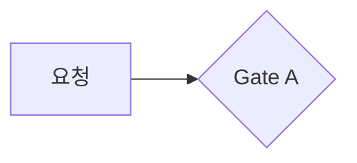

# 📐 문서 컨벤션

이 vault에 문서를 추가·수정할 때 따르는 규약. "어딘가 찾으면 나온다"가 되도록 일관성을 맞추는 게 목적입니다.

> 📄 이 저장소는 **설계 문서(Markdown)** 입니다 — 실행 코드는 없습니다. 코드 블록은 설계 의도·테스트 방법 예시예요.

---

## 🗂️ 파일·디렉토리

- 파일명은 **kebab-case 영문** + `.md` (예: `perm-version-propagation.md`). 한글 파일명·snake_case 금지.
- 디렉토리:
  - `core/` — 아키텍처·요구·스키마·운영·검증 (한 주제당 한 파일)
  - `decisions/` — "왜 이렇게 했나" 의사결정 (비교 + 결정)
  - `explainers/<주제>/` — 학습 문서. 주제 = `auth · billing · data-modeling · security · compliance · operations`
- 새 explainer는 **반드시 주제 디렉토리 안**에 두고, 그 디렉토리의 `README.md` 인덱스와 `explainers/README.md` 마스터 인덱스에 한 줄 추가.

---

## 🏷️ Frontmatter

타입별로 필드가 다릅니다.

**core / decision**
```yaml
---
type: core            # 또는 decision
status: 채택           # decision 한정(채택·보류·폐기)
aliases: [ ... ]       # Obsidian 검색용 한글/영문 별칭
tags: [platform-db, core]   # 또는 decision
---
```

**explainer**
```yaml
---
difficulty: 초          # 초 · 중 · 고 (셋 중 하나)
tags:
  - platform-db
  - explainer
  - <우선순위>          # p0 · p1 · p2 (선택)
  - <주제·개념 태그>     # security, authz, billing …
aliases: [ ... ]
---
```

- **난이도는 `초 · 중 · 고`** 세 단계만. (이전 표기 기초/중급/고급은 폐기.)
- 모든 문서 태그에 `platform-db` 루트 태그 + 타입 태그(`core`/`decision`/`explainer`/`index`) 포함.

---

## 🏷️ 태그 택소노미

태그는 4계층으로 답니다. Obsidian 태그 패널·그래프에서 일관되게 걸리도록 아래 어휘를 씁니다.

| 계층 | 예 | 규칙 |
|---|---|---|
| 루트 | `platform-db` | 모든 문서 필수 |
| 타입 | `core` · `decision` · `explainer` · `index` | 문서 종류 하나 |
| 도메인 | `auth` · `authz` · `billing` · `security` · `compliance` · `operations` · `data-modeling` | 주제(디렉토리와 일치) |
| 개념·우선순위 | `rbac` · `abac` · `rebac` · `rls` · `multitenancy` · `transaction` · `pii` · `p0`~`p2` … | 0개 이상, 검색 가속용 |

- 새 개념 태그는 기존 어휘를 먼저 찾아 재사용합니다(동의어 난립 금지).
- 우선순위(`p0`~`p2`)는 explainer에서 선택적으로.

---

## 🔖 요구사항·결정 ID

`requirements.md`·`decisions`의 항목은 `<분류>-<번호>` 형식의 ID를 갖습니다 (예: `USR-1`, `RBAC-2`, `EXT-3`, `TEN-6`, `D6`).

- **분류 접두사가 의미**입니다 — `USR`(사용자)·`AUTHN`(인증)·`RBAC/ABAC/REBAC`(인가)·`TEN`(테넌시)·`CON`(동의)·`SEC`(보안)·`AUD`(감사)·`OPS/OPER`(운영)·`EXT`(확장성) 등.
- **번호는 분류 안의 일련번호(고정 참조 핸들)일 뿐, 우선순위·순서·의존성을 뜻하지 않습니다.** `RBAC-1`이 `RBAC-2`보다 중요하거나 먼저인 게 아닙니다.
- 우선순위·중요도는 **별도 컬럼**으로 표기 — `출처`(R0~R7), `상태`(P0/P1 + ✅·🟡·⛔·❓).
- **ID는 한 번 매기면 바꾸지 않습니다.** 다른 문서(`bdd-scenarios` 추적 매트릭스·`schema-reference`·`e2e-journeys`·`decisions`)가 ID로 참조하기 때문입니다.
- **삭제·병합 시 번호를 재사용하지 않고 빈틈을 둡니다** (예: `CON-11`·`TEN-7·8` 결번). 재번호하면 기존 참조가 깨집니다 — 코드 enum 값을 지울 때 번호를 재사용 안 하는 것과 같은 이유.

---

## 📑 explainer 표준 구조

학습 문서는 아래 순서를 따릅니다 (없는 절은 비워두지 말고 채우기).

```markdown
# 제목

> **대상**: (독자 한 줄) · **연관 문서**: [[...]]

## Q1. …
## Q2. …
…

## 용어 정리      ← 핵심 용어 표
## 테스트 방법     ← vitest/supertest·Testcontainers 예시 (필수)
## 마치며         ← 한 문단 요약
## 연결된 개념     ← [[wikilink]] 모음
```

- **`테스트 방법` 절은 필수.** 실제 DB·ORM에서 돌리는 법은 [[testing-strategy]] · [[orm-testing-drizzle]]로 연결.
- "대상" 줄은 독자만 적습니다. 페르소나·모드 문구(예전 "사수 모드")는 넣지 않음.

---

## 🔗 Wikilink

- 기본은 `[[basename]]`. 별칭이 필요하면 `[[basename|보여줄 텍스트]]`.
- **같은 basename이 두 곳에 있으면 경로를 한정**합니다. 예: `gate-b-billing-grace`는 `decisions/`와 `explainers/auth/` 양쪽에 있으므로
  - `[[decisions/gate-b-billing-grace|Gate B 유예 결정]]`
  - `[[explainers/auth/gate-b-billing-grace|Gate B 유예 설명]]`
- 커밋 전 `python3 /tmp/verify_links.py`로 미해결·모호 타깃 0건 확인.

---

## 🚦 상태 표기 = 설계 성숙도

코드 구현 여부가 **아니라** 설계가 얼마나 굳었는지를 뜻합니다.

| 표기 | 의미 |
|---|---|
| ✅ | 설계 확정 (DDL·결정 있음) |
| 🟡 | 설계 부분 (더 다듬을 여지) |
| 🔴 | 미설계/부채 |
| ⛔ | 보류 (의도적으로 안 함) |
| ❓ | 미결정 |

---

## 🐘 DB 엔진 표기

이 설계의 DDL·정책은 **PostgreSQL이 1순위**입니다. MySQL 인프라를 쓴다면 각 절의 콜아웃을 따릅니다.

```markdown
> 🐬 **MySQL이라면**: (동등한 MySQL 표현)
```

---

## 📊 다이어그램

흐름·상태머신·ERD는 **mermaid**를 권장합니다 (Obsidian 네이티브 렌더).

````markdown

````

- 시퀀스(`sequenceDiagram`), 상태(`stateDiagram-v2`), ERD(`erDiagram`), 흐름(`flowchart`)을 상황에 맞게.
- 기존 ASCII 박스는 핵심 흐름만 mermaid로 승격하고, 단순한 건 그대로 둬도 됩니다.

---

## ✍️ 커밋

- 제목 소문자 `docs(platform_db): <설명>`
- One Task = One Commit
- 산출물은 모두 한국어
