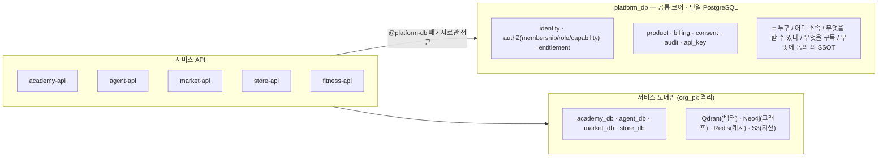
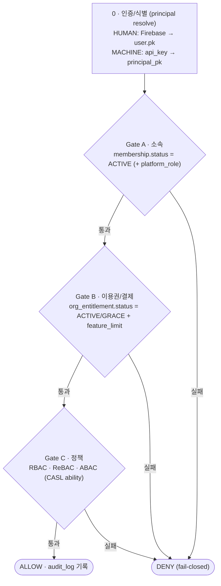

# platform_db — 아키텍처 & 규율

> 이 문서 = **시스템 아키텍처 + 강제 규율(governance)**. *"이렇게 되어 있고, 이렇게 해야 한다"*를 적는다.  
> 분업: **왜** → `decisions/` · **운영** → [[operability]] · **무엇** → [[requirements]] · **행위 검증** → [[bdd-scenarios]] · **개념 Q&A** → `explainers/`  
> 작성일: 2026-05-28 

---

## 1. 시스템 아키텍처

### 1.1 토폴로지

회사의 여러 SaaS(academy / agent / market / store / fitness)를 받치는 **공통 플랫폼 코어 DB**.



**한 줄 철학**: *공통은 묶고(strong consistency), 도메인은 뗀다(독립 확장)* — **비대칭 분리**([[design-asymmetry]]).

> **🐘 DB 권장: PostgreSQL (1순위)**: 이 설계는 PostgreSQL을 1순위로 권장한다. RLS 네이티브(`CREATE POLICY`)·JSONB GIN·선언적 파티셔닝(TIMESTAMPTZ 그대로)·`pgcrypto`·`FOR UPDATE SKIP LOCKED`·트랜잭셔널 DDL을 그대로 활용한다. **회사 인프라가 MySQL이면 각 절의 "🐬 MySQL이라면" 노트를 따른다** — 그 경우 RLS 부재는 앱 레이어 `org_pk` 강제 + CI 린트로, TIMESTAMP 파티셔닝 버그는 DATETIME 우회로 보강한다.

### 1.2 권한 모델 — 3-gate

**인증으로 *누구냐*를 식별(step 0)한 뒤, 세 게이트(소속·이용권·정책)를 모두 통과해야 `ALLOW`.** 각 게이트는 fail-closed — 하나라도 막히면 `DENY`. (인증은 게이트가 아니라 사전 식별 단계다.)



게이트별 확인 대상:

| 단계 | 질문 | 확인 |
|---|---|---|
| 0 인증 | 누구냐 | Firebase JWT(`firebase_uid`) 또는 `api_key` → `principal_pk` 해석 |
| Gate A 소속 | 어디 소속이냐 | `membership(principal, org).status = ACTIVE` (+ `platform_role`) |
| Gate B 이용권 | 구독·결제가 유효한가 | `org_entitlement(org, service).status ∈ {ACTIVE, GRACE}` + `feature_limit` |
| Gate C 정책 | 무엇을 할 수 있나 | RBAC `role_code→ROLE_PERMISSION` · ReBAC `delegation_grant` · ABAC `owner_pk`+환경 |

| 모델 | 의미 | 저장 |
|---|---|---|
| RBAC | 직책/소속 | `service_membership.role_code` + 코드 `ROLE_PERMISSION` ([[role-as-code]]) |
| ABAC | 속성(소유·테넌트·한도·환경) | 리소스 컬럼 + `org_entitlement.feature_limits` + client_ip |
| ReBAC | 관계/위임 | `delegation_grant.capability`(임퍼소네이션 금지) |
| 계층 | 조직 위계 | `org_relation`(HQ_BRANCH/HOLDING) — **권한 근거 아님, 명시적 membership만** |

- 평가기 단일(CASL). 캐싱은 *입력 블록*(membership/grants/entitlement)만 TTL 60s, **최종 can() 캐싱 금지**.
- `perm_version` self-healing: 권한 변경→bump→`X-Perm-Version` 불일치→snapshot 재요청. 개인=user_pv / org=org_pv 분리(thundering herd 회피).
- **현황**: DB 함수(`checkGateA/B`)는 ✅. 단 `GateAGuard`(실시간 재검증)는 🧊 Icebox — 현재 Firebase custom claims로 간접 커버(취소 시 ~1h stale, 민감 쓰기는 `@VerifyOnDb`로 메움). `checkGateB`는 `GateBGuard`로 래핑(기본값 `"ACADEMY"` — [[service-extensibility]] EXT-5).

> **⚙️ 모델 edge**: 머신 신원은 `api_key` 기본(P6)까지. **B2B 심화**(OAuth Client Credentials · API versioning · scope-per-product)는 미모델 — api_key 위 확장 필요 ([[requirements]] §7.2 B2BAPI-1).

### 1.3 데이터 일관성 — billing → projection → auth

```
PG Webhook (Stripe/Toss 이벤트 스트림)
    ↓
org_subscription  ← Billing Canonical Truth (provider, invoice, retry, grace, refund, trial, ...)
    ↓ [이벤트 투영 — 단일 트랜잭션]
org_entitlement   ← Authorization Projection (status, valid_until, grace_until, feature_limits)
    ↓
Gate B            ← can_access? 만 판단. subscription 직접 조회 금지(불변식 #4)
```

- **왜 분리하나**: billing 복잡도(provider/invoice/retry)를 auth에서 격리 → auth 단일 테이블 조회, billing 장애 격리, 캐시 단순. ([[auth-projection]])
- **결제 단일 트랜잭션**: `payment_ledger INSERT(CHARGE) + org_subscription UPDATE + org_entitlement UPSERT + perm_version bump + outbox INSERT`를 한 Postgres 트랜잭션으로 → **"결제됐는데 권한 미반영" 창 0**(2PC·Kafka 불필요). ([[payment-atomicity]])
- 멱등 2중: webhook `event_id` UNIQUE + payment `idempotency_key` UNIQUE([[idempotency-key]]). 환불은 append-only. async 부수효과만 outbox([[outbox-pattern]]).
- eventual consistency 수용: webhook→투영 수 초 지연 허용(SaaS 표준). 배치 실패 안전망은 Gate B `validUntil` 복합체크([[decisions/gate-b-billing-grace|gate-b-billing-grace]]).

> **⚙️ 모델 edge**: `outbox`=내부 async 발행, PG `webhook`=**인바운드 전용**. **아웃바운드 고객 webhook**(우리→고객 시스템)·**정산**(franchise 본사↔지점 매출 분배)은 미모델 — 새 컴포넌트 필요 ([[requirements]] §7.2 WEBHOOK-OUT-1·SETTLE-1).

### 1.4 멀티테넌시 — Pool 모델 + 분리 트리거

**전략: 공유 DB + `org_pk` 행 격리**([[multitenancy-pool]]).

| 저장소 | 격리 방법 | 상태 |
|---|---|---|
| PostgreSQL | RLS(`CREATE POLICY … USING(org_pk=current_setting('app.org_pk')::bigint)`)로 DB가 격리 강제 + `org_pk NOT NULL`·앱 레이어 `WHERE org_pk`(defense-in-depth) | ✅ RLS + 스키마 강제 · 🟡 CI 린트 보조 미완 |
| Qdrant | `org_id` payload 필터 강제 | ✅ · 🟡 `is_tenant` 마커 미추가 ([[rag-multitenancy]]) |
| Neo4j | `orgId` 노드 속성 + Cypher 강제 | ✅ · 🟡 APOC 쓰기측 차단 P1 |
| Redis | key prefix `org:{org_pk}:...` | ✅ |

**분리 트리거** — 하나라도 충족 시 착수 (단계: Read replica → 고속 테이블 분리 → DB-per-large-tenant):

| 트리거 | 조건 | 행동 |
|---|---|---|
| T1 | 단일 org가 고속 테이블 행의 20%+ | 해당 테넌트 전용 DB |
| T2 | 대화/로그 P99 > 500ms | 해당 테이블 별 인스턴스 |
| T3 | usage_log 월 500만+/50GB+ | OLAP(ClickHouse/BigQuery) 이관 |
| T4 | ISMS-P/GDPR 계약 | 물리 격리 DB·리전 + 감사 외부 WORM |

cross-tenant 집계는 **아키텍처 분리**(`internal/`·`*-admin`) — Admin role 금지([[cross-tenant-separation]]). 운영자 cross-tenant는 [[operator-plane]] 경유.

> **⚙️ 모델 edge**: 조직 계층은 `org_relation`의 **HQ_BRANCH/HOLDING 2단**까지. 다단계 프랜차이즈/병원 지점 같은 **깊은 계층**은 미모델 — 재귀 org 그래프 필요 ([[requirements]] §7.2 ORGGRAPH-1).

### 1.5 정책·동의 모델

- **`user_consent_event` append-only**: `user × consent_type × terms_version × action(GRANTED/REVOKED) × meta_json × prev_hash/row_hash`. 반복 이력 전부 보존([[pipa-consent]]).
- **consent_type 네임스페이스**: `platform.*`(계정) / `pg.*`(결제 제3자) / 서비스 `*`(도메인 DB).
- **전자서명법 §3**: 약관 체크박스 동의 = 서면 서명과 동일 효력. `user_consent_event` row가 법적 증거.
- **데이터 이전 경계**: 본인 정보(identity·profile·멤버십)는 이전 가능, 학생·수업기록·결제이력은 org 소유로 이전 불가 — `org_pk NOT NULL` 격리가 강제. (동의: `platform.content_ownership`·`platform.data_transfer`)
- **법 요건**: 14세 미만 법정대리인 동의(§22, 법적 필수) · 제3자 제공 4요건(§17, meta_json + JSON Schema + RFC 8785 canonical) · 철회권(§37, REVOKED + perm_version) · 마케팅 옵트아웃(정보통신망법 §50).
- 보존 5년 + 해시 사슬(tamper-evident). 약관 본문은 S3/CMS, DB엔 `terms_version`만.

---

## 2. 규율 (Governance) — 위반 시 PR 반려

### 2.1 불변식 — 코드 검증됨, 위반 PR 반려

1. **Firebase = 인증, 인가 = 우리 DB.** `firebase_uid`는 조회 키일 뿐 PK/FK 아님.
2. **내부 PK는 BIGINT, 외부 노출은 ULID(`public_id`).** 시퀀셜 PK를 URL·API에 노출 금지.
3. **테넌트 데이터를 담는 모든 도메인 테이블은 `org_pk NOT NULL`.** 예외는 3부류뿐 — ① 전역 카탈로그(`product`·`product_sku`·`plan_definition`) ② 플랫폼 이벤트 버스(`pg_webhook_event`·`outbox_event`) ③ `audit_log`(SYSTEM actor 이벤트는 org 무관, nullable). `user_consent_event`는 user-scoped, `subscription_item`은 부모로 격리. 그 외 누락 = PR 반려([[schema-reference]] §G.1).
4. **`canXXX()`는 `org_entitlement`만 읽는다.** `payment_ledger` 직접 조회 금지. entitlement는 billing의 authorization projection이며 Gate B의 유일 진실 원천.
5. **`service`는 `VARCHAR(50)` + `CHECK`.** ENUM 아님. 새 서비스 = CHECK 1줄 추가([[service-extensibility]]). 현재: `ACADEMY`·`MARKET`·`AGENT`·`YOUTUBE`·`STORE`.
6. **cross-DB는 아래로만.** `service_db → platform_db` 읽기 OK. 옆으로(`academy_db → store_db`) 금지. cross-schema FK 금지([[fk-strategy]]).
7. **strong consistency = 단일 서버 트랜잭션. async = outbox.**
8. **`checkGateB(orgPk, service)`는 서비스를 명시.** 기본값 `"ACADEMY"`. 신규 서비스는 명시 전달.
9. **Gate B는 `status + valid_until` 복합 체크.** `status IN ('ACTIVE','GRACE') AND (valid_until IS NULL OR valid_until > NOW())`. status만 보면 배치 실패 시 영구 무료 위험.
10. **`org_entitlement.feature_limits`가 런타임 한도의 최종 권위.** product_feature·plan_definition은 초기값 복사용. 런타임 직접 조회 금지.
11. **구독은 N:M.** `subscription_item(subscription_pk, sku_pk)`이 진실 원천. `org_subscription`은 헤더만, sku_pk 단일 FK 금지.

파생 표준: `public_id`는 외부 노출 테이블만 · soft-delete 3종(status/deleted_at/append-only, [[delete-patterns]]) · 금액은 정수 minor unit(float 금지).

### 2.2 보안 규율

- **OWASP BOLA**: org_pk 질의 강제를 Drizzle base repo로 프레임워크화(복합 UNIQUE 불요 — 실체는 질의 필터).
- **NIST SP 800-162 환경속성**: api_key `allowed_ip_cidr` + Gateway/WAF IP 강제.
- **감사 불변성(ISMS-P/SOC2)**: app 계정 UPDATE/DELETE 권한 제거 + 해시 체이닝 → 외부 WORM(S3 Object Lock). *트리거는 root가 DROP 가능해 채택 안 함.* ([[audit-hash-chain]])
- **Secret/Key**: KMS(refresh_token·서명PDF), 평문/`.env` git 금지. Firebase Web API Key=공개(App Check+도메인제한), Admin SDK 키=회전 대상.
- **데이터 분류**: PII / 민감(health) / 미성년(guardian) / 결제연계 → 차등 보호. 선별 app-level 암호화(secret·guardian만, phone/email은 KMS+접근통제).
- **감사 2-lane**: 컴플라이언스(보안유의 100%·WORM) vs access 텔레메트리(샘플링) — [[audit-two-lane]].

### 2.3 마이그레이션 상태·목표 (G1~G3)

> role 2단 분리가 설계 확정(현행 스키마). G1/G2 완료, G3 부분.

- **G1. role 2단 분리** (D1) — ✅ **설계 확정**: `platform_role`(OWNER/MEMBER/SERVICE, ⚠️ ADMIN 미채택) + `service_membership.role_code`([[role-capability]]).
- **G2. capability 네임스페이스** (D2) — ✅ **설계 확정**: `ACADEMY.<action>`. ⚠️ CHECK 하드코딩은 [[service-extensibility]]에서 의도적 수용.
- **G3. `organization.org_kind`** (D5) — 🟡 **설계 부분**: `type VARCHAR(10)+CHECK('COMPANY','TEAM','PERSONAL')`(ACADEMY 제거 ✅). 완전 service-agnostic한 `org_kind VARCHAR(30)+CHECK`로의 의미 일반화는 미완(저빈도 변경이라 비용 낮음).

### 2.4 비목표 (Non-Goals)

**거부 — 더 나은 방법이 있어 *영구히* 안 한다** (모호 아님, 결정)

| 거부 | 대신 (결정 위치) |
|---|---|
| 완전 MSA(auth/billing/role DB 분리) | 비대칭 분리([[design-asymmetry]]) — 분산 트랜잭션 회피 |
| audit `BEFORE UPDATE` 트리거 | 해시 체이닝→WORM([[audit-hash-chain]]) — 트리거는 root가 DROP 가능 |
| BOLA 복합 UNIQUE `(org_pk, public_id)` | ULID 전역 UNIQUE + 질의 필터(§2.2) |
| api_key `allowed_environments` JSON 블롭 | 구조화 scopes — 불변식 #6 |
| phone/email 전면 암호화 | 선별 암호화(secret·guardian) + KMS(§2.2) |

**유보 — 지금은 과스펙, *명시 트리거*에서만 도입** (차후 진행 방향 확정)

| 유보 | 도입 트리거 | 그전까지 |
|---|---|---|
| 외부 정책 엔진(OpenFGA) | org 1,000+ | CASL + 코드 상수([[role-as-code]]) |
| DB role/capability 레지스트리 | 테넌트 커스텀 롤 실수요 | 코드 상수가 권위 |
| Zanzibar relation_tuple | delegation_grant로 표현 못 하는 관계 발생 | delegation_grant |
| Kafka/Debezium CDC | T4(ISMS-P/SOC2) | outbox([[payment-atomicity]]) |
| 샤딩 / DB-per-tenant | §1.4 T1~T4 | Pool 모델([[multitenancy-pool]]) |

> **usage**: 실시간 한도 카운터는 **서비스측**(ABAC-3) → platform 비목표. 단 **집계 `usage_snapshot`은 비목표 아님** — 운영상 필요([[operability]] O4).  
> **휴면(DORMANT)**: 법 의무 아님(유효기간제 2023 폐지) → 선택적 제품 결정(§5.3).  
> **범위 경계(enterprise 원본 대비)**: 정산·아웃바운드 webhook·다단계 조직그래프·B2B 심화 → [[requirements]] §7. 구조 edge는 §1.2~§1.4 ⚙️.

---

## 3. 결정 색인 → decisions/

> **설계 연혁**: R0~R8 자문(멀티테넌시·cross-service 권한·보안표준·정책동의·자체비교·외부자문)을 거쳐 수렴. **라운드별 상세·기각·대안은 `decisions/`가 보유** — 여기는 색인.

### 3.1 핵심 결정 D1~D12 (구현 상태)

| ID  | 결정                                              | 상태 · 문서                                      |
| --- | ----------------------------------------------- | -------------------------------------------- |
| D1  | role 2단(`platform_role` + `service_membership`) | ✅ 설계 확정 · [[role-capability]]                 |
| D2  | capability 네임스페이스 `<service>.<action>`          | ✅ 설계 확정 · [[service-extensibility]]           |
| D3  | role→action = **코드 상수**(DB 레지스트리 거부)            | ✅ · [[role-as-code]]                         |
| D4  | 서비스 계정 = `platform_role='SERVICE'` + api_key    | 🟡 SERVICE 확정 / api_key 코드 트랙 별도              |
| D5  | `org_kind` generic + 서비스는 entitlement           | 🟡 부분 구현                                   |
| D6  | service 식별자 `VARCHAR(50)+CHECK`(전역 타입 결합 회피)  | ✅ · [[service-extensibility]]                |
| D7  | `user_consent_event` append-only                | ✅ 설계 확정 · [[pipa-consent]]               |
| D8  | `api_key` 하드닝                                   | ✅ 설계 확정                                  |
| D9  | `permission_snapshot`은 프론트 read-model만          | 🟡 P1                                        |
| D10 | 멀티테넌시: PG RLS로 격리 강제 + 앱 org_pk·CI 린트(보조) | ✅ RLS · 🟡 린트 · [[multitenancy-pool]]      |
| D11 | 표준보안: BOLA / NIST / 해시→WORM                     | 🟡 BOLA ✅, 해시·WORM P1 · [[audit-hash-chain]] |
| D12 | 운영보강: 논리 소유권·break-glass·키 cadence              | 🟡 · [[operability]]                         |

> **D6 미적용 사례**: `service` VARCHAR+CHECK 원칙을 `pg_provider`(4곳)·`billing_event.event_type`에 미일관 적용 → 후속 ENUM→VARCHAR(50)+CHECK 마이그레이션 대상([[schema-reference]]).

### 3.2 결정 문서 (비교 → 결정)

**경계·구조**: [[design-asymmetry]] · [[identity-billing-access]] · [[service-extensibility]]  
**멀티테넌시·격리**: [[multitenancy-pool]] · [[cross-tenant-separation]] · [[rag-multitenancy]]  
**billing·권한**: [[auth-projection]] · [[payment-atomicity]] · [[decisions/gate-b-billing-grace|gate-b-billing-grace]] · [[firebase-boundary]] · [[role-as-code]]  
**운영 가능성**: [[operator-plane]] · [[audit-two-lane]]

> RAG 검색 품질(Qdrant+Neo4j 이중 색인)·content-api 도메인 레이어링은 academy 서비스 도메인이라 본 핸드북 범위 밖.

---

## 4. 운영 → operability/

> 운영 **모델·절차·신뢰성 계약·관측 KPI**는 [[operability]](O1~O6). 여기는 아키텍처가 강제하는 **운영 규율**만.

- **append-only 강제**: `audit_log`·`user_consent_event`·`payment_ledger`·`billing_event`는 INSERT만 — 전용 INSERT-only 계정(`audit_append`·`consent_append`·`ledger_append`)으로만 write하고 `platform_rw`는 해당 4종에 UPDATE GRANT 미보유([[schema-reference]] §M). 주석이 아니라 GRANT가 강제.
- **권한 변경**: 역할 *배정* 변경 = DB UPDATE + `perm_version` bump(즉시). 역할 *룰*(`ROLE_PERMISSION`) 변경 = **코드 배포**.
- **Break-glass는 silent 금지**: 전건 audit + 만료 자동회수 + 사후 리뷰([[break-glass]] · [[operator-plane]]).
- **운영자는 tenant role이 아님**: 별도 신원 평면 + cross-tenant는 아키텍처 분리·break-glass 경유([[operator-plane]]).
- **정기 배치 필수**: TRIALING→EXPIRED·파티션 추가·sweeper·해시검증 미작성 시 사고([[operability]] O3).
- **secret rotation cadence**: api_key 90/365d · KMS DEK 연1회 · Firebase Admin SDK 180d · DB 계정 180d.

---

## 5. 로드맵 · 준거 · 열린 결정 · 용어

### 5.1 기능 우선순위

**P0 (서비스 최소 요건)**: 멀티DB 연결 · identity/membership/org_relation · `org_entitlement`+3-gate · `user_consent_event`(14세·제3자, PIPA 법적 필수) · `audit_log`+파티션 · `service` VARCHAR+CHECK.  
**P1 (운영 요건)**: `api_key`+하드닝 · 결제 연동(ledger+webhook+outbox) · perm_version 멀티인스턴스 전파 · 감사 해시체이닝 · 열람 fan-out · CI 린트(org_pk 누락) · Qdrant `is_tenant` · Neo4j APOC 차단 · **운영 가능성(operator-plane·audit-2lane·permission-debug)**.  
**P2 (트리거 조건부)**: 외부 WORM(T4) · DB role 레지스트리(커스텀롤) · usage OLAP(T3) · OpenFGA(1000+) · Option B `platform-api`(소비앱 3개+) · DB-per-tenant(T1/T2) · Kafka CDC(T4).

### 5.2 법·표준 준거

> "설계 확정" ≠ "구현 완료". ⚠️는 설계는 됐으나 코드 없음. 감사자는 ⚠️를 준수로 읽으면 안 됨.

| 근거 | 설계 | 구현 |
|---|---|---|
| PIPA §15 보유 / §17~18 제3자 / §22 14세 / §35 열람 / §37 철회 | ✅ 설계(§22·§35 일부) | 코드 트랙 별도 (§22 **법적 필수**) |
| 정보통신망법 §50 수신거부 / 국외이전 고지 | ✅ 설계 | 코드 트랙 별도 |
| (구)유효기간제 휴면 | ⛔ | ⛔ 2023 폐지 — 법 의무 아님 |
| NIST SP 800-162 ABAC | 🟡 | 🟡 Subject×Object ✅, Environment P1 |
| OWASP API #1 BOLA | ✅ | ✅ org_pk 질의 강제 |
| ISMS-P/SOC2 | 🟡 | 🟡 append-only ✅, 해시 P1, WORM P2, break-glass P1 |

### 5.3 열린 결정

1. **ROLE_PERMISSION 변경 배포 SLA**(hot-fix vs weekly) — 명문화 필요.
2. 만 14세 미만 본인확인 강도(서명 PDF vs PASS/카카오) — 법무.
3. 감사 외부 WORM 시점(P2 vs ISMS-P 일정).
4. 데이터 리전/주권(단일 Seoul vs 해외 고객 시 분리).
5. 휴면(DORMANT) 채택 여부 — 제품 결정.
6. 결제 정식화 범위(쿠폰/proration/인보이스/세금).
7. 강사 콘텐츠 소유권 ToS 조항 — 법무 확정 필요.
8. 이메일 인증 필수 기능 범위(email_verified=false 차단) — 제품 결정.

### 5.4 용어 사전

| 용어 | 뜻 |
|---|---|
| `platform_db` | identity+billing+product+consent+audit 공통 코어 단일 DB |
| `membership.platform_role` | 테넌트 권위(OWNER/MEMBER/SERVICE) |
| `service_membership.role_code` | 서비스별 도메인 역할(academy.DIRECTOR 등) |
| `org_entitlement` | 런타임 권위 access 상태 — Gate B 유일 진실 원천 |
| `delegation_grant.capability` | 위임 capability(`<service>.<action>`), ReBAC |
| `org_relation` | 조직 계층 — **권한 근거 아님** |
| `user_consent_event` | append-only 동의 이벤트(PIPA) |
| `outbox_event` | async 부수효과 발행원 |
| `perm_version` | 권한 변경 전파 카운터(user_pv/org_pv 분리) |
| 3-gate canXXX | A 소속 · B 이용권 · C 정책 |
| Pool 모델 | 공유 DB + org_pk 행 격리 |
| Option A→B | 공유 패키지 → HTTP 서비스 전환 |
| Break-glass | 승인된 긴급 운영 접근(임퍼소네이션과 다름) |
