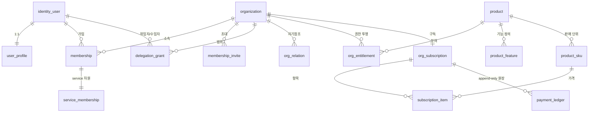

# platform_db — 스키마 레퍼런스

> 작성일: 2026-05-28 
> 진입점: [[architecture]] (개요·결정·운영) · 검증: [[requirements]] (요구사항·BDD)
>
> **이 문서**: `platform_db`의 기술 레퍼런스 — DB 토폴로지·ERD·스키마 DDL·3-gate·billing 흐름·멀티테넌시·보안·consent 모델.  
> "왜/운영"은 architecture.md, "요구/검증"은 requirements.md.
>
> 📄 **설계 문서**: 아래 DDL·상태는 *설계* 기준이며 구현 코드는 이 저장소에 없다(코드는 별도 저장소, 범위 밖).

---

# A. DB 토폴로지 & 접근 전략

## A.1 DB 구조

```
PostgreSQL 16 (단일 인스턴스)
├── platform_db          ← 모든 서비스 공유 (이 문서 범위)
│     [identity]   organization, identity_user, user_profile
│                  membership, membership_invite, delegation_grant
│                  org_relation, audit_log
│     [billing]    plan_definition, product, product_feature, product_sku
│                  org_entitlement, org_subscription, subscription_item
│                  payment_ledger, pg_webhook_event, outbox_event
│                  billing_event
│     [product]    product, product_feature, product_sku
│     [consent]    user_consent_event  (설계 확정 · 코드 트랙 별도 — §I)
│     [api_key]    api_key             (설계 확정 · 코드 트랙 별도 — §J)
│
├── academy_db           ← academy-api 전용. 모든 테이블에 org_pk NOT NULL
├── agent_db             ← 설계 확정 (§L 참조)
├── market_db            ← 설계 확정 (§L 참조)
└── store_db             ← 설계 확정 (§L 참조)
```

**cross-DB 방향 규칙**:
- `서비스DB → platform_db` 읽기: **허용**
- `platform_db → 서비스DB`: **금지**
- `academy_db → store_db` (peer): **금지**
- cross-schema FK: **전면 금지** (독립 백업/복원 보장)

> **🐘 PostgreSQL 1순위 권장**: 이 문서의 DDL·정책은 PostgreSQL을 기준으로 작성한다. RLS 네이티브(`CREATE POLICY`)·JSONB GIN·선언적 파티셔닝(TIMESTAMPTZ 그대로)·`pgcrypto`·`FOR UPDATE SKIP LOCKED`를 1순위로 활용한다. **회사 인프라가 MySQL이면 각 절의 "🐬 MySQL이라면" 노트를 따른다.**
>
> | 이유 | 상세 |
> |---|---|
> | **RLS 네이티브 지원** | `CREATE POLICY org_isolation ON table USING (org_pk = ...)` — §G "CI 린트 보강" 우회로가 처음부터 불필요 |
> | **JSONB GIN 인덱스** | `feature_limits`, `meta_json`, `payload_json`에 `@>` 연산자 인덱스 → MySQL JSON 대비 대폭 빠른 쿼리 |
> | **파티셔닝 완전 지원** | `audit_log.created_at`에 TIMESTAMPTZ 그대로 사용 + 선언적 `PARTITION OF` 자식 테이블 |
> | **`pgcrypto` 내장** | 감사 해시 체이닝(`prev_hash`/`row_hash`)을 DB 네이티브 SHA-256으로 처리 — 앱 레이어 불필요 |
> | **`FOR UPDATE SKIP LOCKED`** | outbox_event 워커 lock 경합 없는 네이티브 지원 |
> | **GENERATED ALWAYS / CTE writes** | IDENTITY 컬럼, writable CTE, 풍부한 타입 지원 |
>
> 각 DDL 블록은 PostgreSQL 형이 1순위이고, 🐬 MySQL이라면 노트가 동등 기능의 MySQL 표현을 제공한다.

## A.2 접근 계층

```
소비 앱 (academy-api, agent-api, …)
  ↓ 유일한 경로
@platform-db 패키지
  ├── identity/index.ts   (getOrganization, getMembership, …)
  ├── billing/index.ts    (getEntitlement, getFeatureLimit, …)
  └── gates.ts            (getPermissionContext, checkGateA/B)
  ↓
Drizzle ORM → platform_db (PostgreSQL)
```

Drizzle 스키마 직접 참조 금지. 패키지 함수만 호출.

---

# B. 식별자 체계

| 용도 | 타입 | 규칙 |
|---|---|---|
| 내부 PK / JOIN | `BIGINT GENERATED ALWAYS AS IDENTITY` | DB 외부 노출 금지 |
| 외부 노출 | `CHAR(26)` ULID (`public_id`) | API 응답, URL에 사용 |
| Firebase UID | `VARCHAR(128)` | 인증 연결 키. PK·FK 아님 |
| API Key | `VARCHAR(255)` prefix+hash | B2B 머신 인증 (§J) |

내부 PK는 서명 `BIGINT`(최대 ~9.2×10¹⁸) 범위로 충분 — PG엔 UNSIGNED가 없으나 식별자 고갈은 비현실적이다. ULID `public_id`(외부)와 BIGINT 내부 pk를 분리하는 전략은 그대로 유지한다.

> 🐬 **MySQL이라면**: 내부 PK는 `BIGINT UNSIGNED AUTO_INCREMENT PRIMARY KEY`, FK 컬럼은 `BIGINT UNSIGNED NOT NULL`.

## B.1 공통 DDL 규약 (PostgreSQL 기준)

아래 규약은 이 문서의 모든 DDL 블록에 일관 적용된다. 개별 테이블에는 PG 형만 보여주고, MySQL 대응은 여기에 한 번 정리한다.

| 항목 | PostgreSQL (1순위) | 🐬 MySQL이라면 |
|---|---|---|
| 식별자 PK | `BIGINT GENERATED ALWAYS AS IDENTITY PRIMARY KEY` | `BIGINT UNSIGNED AUTO_INCREMENT PRIMARY KEY` |
| FK 컬럼 | `BIGINT NOT NULL` | `BIGINT UNSIGNED NOT NULL` |
| 음수 불가 수량 | `BIGINT NOT NULL + CHECK (col >= 0)` (UNSIGNED 없음) | `BIGINT UNSIGNED` |
| 시각 | `TIMESTAMPTZ ... DEFAULT now()` | `TIMESTAMP ... DEFAULT NOW()` |
| 자동 갱신 | `updated_at`은 트리거/앱 (아래) | `... ON UPDATE NOW()` |
| 가변 집합 컬럼 | `VARCHAR(n) + CHECK (col IN (...))` | `ENUM(...)` 또는 동일 패턴 |
| 반구조화 | `JSONB` (+ GIN 인덱스 가능) | `JSON` |
| 이진 | `BYTEA` | `VARBINARY(n)` |

- **금액·카운트 컬럼**(`price_krw`, `tokens_used`, `used`, `quantity`, `amount*` 등): PG엔 UNSIGNED가 없으므로 `CHECK (col >= 0)`로 음수를 막는다.
- **`updated_at` 갱신**: PG엔 `ON UPDATE NOW()`가 없다. `BEFORE UPDATE` 트리거 `set_updated_at()`(NEW.updated_at := now()) 또는 앱 레이어로 갱신한다. 이 트리거는 **편의 갱신이지 감사 불변성 통제가 아니다**(append-only 4종의 WORM 보장은 GRANT로 강제 — §M, §N.3 트리거 비목표와 무관).
- **ENUM 대신 VARCHAR+CHECK**: PG 네이티브 ENUM은 여러 테이블에 전역 타입으로 결합되고 `ALTER TYPE ADD VALUE`가 트랜잭션 블록 내에서 실행 불가한 제약이 있다. 테이블 로컬이고 풍부한 조건 표현(`IN (...)`, 복합 조건)이 가능한 `VARCHAR(n) + CHECK`를 1순위로 유지한다(§K 온라인 확장도 이 형태가 유리).
- **시각 타입**: 모든 시각 컬럼은 `TIMESTAMPTZ`(UTC 저장). `DEFAULT now()`.

---

# C. ERD

## C.0 전체 관계도



> 아래 C.1~C.3은 영역별 텍스트 상세 + FK 목록.

## C.1 Identity 영역

```
identity_user (1)────(1) user_profile
      │
      │ N
      │
    membership ────── (N) organization (1)
      │  │                     │
      │  └ service_membership (user_pk, org_pk, service) — membership과 1:1 + service 차원
      │                        │
    membership_invite           │ N
                                │
                            org_relation (자기참조, self-ref CHECK)
                                │
                            delegation_grant (grantor_pk, grantee_pk, org_pk)
```

## C.2 Billing 영역

```
organization (1) ────(N) org_entitlement ────(1) product
      │
      │ (1)
      │
org_subscription ────(N) subscription_item ────(1) product
      │
      │ (1)
      │
payment_ledger (append-only)

platform_db 이벤트 버스:
  outbox_event  ← billing 상태 변경 시 INSERT
  billing_event ← 구독 lifecycle 이벤트
  pg_webhook_event ← PG 수신 webhook (멱등 처리)
```

## C.3 관계 요약

| 테이블 | 참조 | FK |
|---|---|---|
| `user_profile.user_pk` | `identity_user.pk` | `fk_up_user` |
| `membership.user_pk` | `identity_user.pk` | `fk_mbr_user` |
| `membership.org_pk` | `organization.pk` | `fk_mbr_org` |
| `service_membership.user_pk` | `identity_user.pk` | `fk_svc_mbr_user` |
| `service_membership.org_pk` | `organization.pk` | `fk_svc_mbr_org` |
| `membership_invite.org_pk` | `organization.pk` | `fk_invite_org` |
| `membership_invite.invited_by` | `identity_user.pk` | `fk_invite_inviter` |
| `delegation_grant.org_pk` | `organization.pk` | `fk_grant_org` |
| `delegation_grant.grantor_pk` | `identity_user.pk` | `fk_grant_grantor` |
| `delegation_grant.grantee_pk` | `identity_user.pk` | `fk_grant_grantee` |
| `org_entitlement.org_pk` | `organization.pk` | `fk_ent_org` |
| `org_subscription.org_pk` | `organization.pk` | `fk_sub_org` |
| `org_subscription.payer_user_pk` | `identity_user.pk` | `fk_sub_payer` |
| `subscription_item.subscription_pk` | `org_subscription.pk` | `fk_sub_item_sub` |
| `subscription_item.sku_pk` | `product_sku.pk` | `fk_sub_item_sku` |
| `product_feature.product_pk` | `product.pk` | `fk_pf_product` |

---

# D. 스키마 상세

## D.1 identity_user

```sql
CREATE TABLE identity_user (
  pk                BIGINT GENERATED ALWAYS AS IDENTITY PRIMARY KEY,
  public_id         CHAR(26)       NOT NULL,              -- ULID (외부 노출 전용)
  firebase_uid      VARCHAR(128),                          -- 인증 연결 키 (PK/FK 아님)
  email             VARCHAR(255),
  email_verified    BOOLEAN NOT NULL DEFAULT FALSE,        -- Firebase JWT email_verified 동기화
  email_verified_at TIMESTAMPTZ,
  phone_e164        VARCHAR(20),                           -- E.164 형식 (+821012345678)
  phone_verified    BOOLEAN NOT NULL DEFAULT FALSE,        -- SMS OTP 또는 Firebase Phone Auth
  phone_verified_at TIMESTAMPTZ,
  type              VARCHAR(10) NOT NULL DEFAULT 'HUMAN',
  status            VARCHAR(10) NOT NULL DEFAULT 'ACTIVE',
  -- DORMANT: 열린결정(architecture.md §5.3) — 법 의무 아님, 제품 정책 결정 후 CHECK 목록에 추가
  perm_version      BIGINT NOT NULL DEFAULT 1 CHECK (perm_version >= 0),
  created_at        TIMESTAMPTZ NOT NULL DEFAULT now(),
  updated_at        TIMESTAMPTZ NOT NULL DEFAULT now(),    -- 갱신은 트리거/앱 (§B.1)
  deleted_at        TIMESTAMPTZ,
  CONSTRAINT chk_identity_user_type   CHECK (type IN ('HUMAN','SERVICE','SYSTEM')),
  CONSTRAINT chk_identity_user_status CHECK (status IN ('ACTIVE','SUSPENDED','DELETED')),
  CONSTRAINT uq_identity_user_public_id    UNIQUE (public_id),
  CONSTRAINT uq_identity_user_firebase_uid UNIQUE (firebase_uid)
);
CREATE INDEX idx_identity_user_email          ON identity_user (email);
CREATE INDEX idx_identity_user_email_verified ON identity_user (email_verified);
CREATE INDEX idx_identity_user_phone          ON identity_user (phone_e164);
```

**설계 포인트**:
- `firebase_uid`: 인증 SSOT. 조회 키일 뿐 FK로 참조 금지
- `perm_version`: 권한 변경 시 bump → 프론트 캐시 invalidation
- `type='SERVICE'`: agent/api_key 사용자. 사람과 동일 3-gate
- `email_verified`: Firebase JWT `email_verified` claim을 DB에 동기화 (TTL 1h stale 방어). 이메일 인증 필수 기능(결제·초대) 차단 근거
- `phone_verified`: SMS OTP 인증 완료 여부. `phone_e164`가 있어도 verified=false면 미인증 상태
- 탈퇴 처리 시: `email=NULL, phone_e164=NULL, firebase_uid=NULL, email_verified=FALSE` (hard anonymize, 30일 배치)

## D.2 user_profile

```sql
CREATE TABLE user_profile (
  user_pk      BIGINT PRIMARY KEY,                   -- identity_user.pk 참조 (FK)
  display_name VARCHAR(120) NOT NULL,
  avatar_url   VARCHAR(500),
  locale       VARCHAR(10)  NOT NULL DEFAULT 'ko',
  timezone     VARCHAR(50)  NOT NULL DEFAULT 'Asia/Seoul',
  updated_at   TIMESTAMPTZ NOT NULL DEFAULT now(),   -- 갱신은 트리거/앱 (§B.1)
  CONSTRAINT fk_up_user FOREIGN KEY (user_pk) REFERENCES identity_user(pk)
);
```

**설계 포인트**: display_name SSOT. 서비스별 추가 프로필 (`academy_db.teacher_profile` 등)은 서비스 DB에.

## D.3 organization

```sql
CREATE TABLE organization (
  pk           BIGINT GENERATED ALWAYS AS IDENTITY PRIMARY KEY,
  public_id    CHAR(26)       NOT NULL,              -- ULID
  type         VARCHAR(10)    NOT NULL,
  -- ACADEMY 제거(서비스 종류는 org_entitlement.service가 결정). 향후: org_kind VARCHAR(30)+CHECK로 전환
  slug         VARCHAR(50)    NOT NULL DEFAULT '',
  name         VARCHAR(100)   NOT NULL,
  status       VARCHAR(10)    NOT NULL DEFAULT 'ACTIVE',
  perm_version BIGINT NOT NULL DEFAULT 1 CHECK (perm_version >= 0),
  created_at   TIMESTAMPTZ NOT NULL DEFAULT now(),
  deleted_at   TIMESTAMPTZ,
  CONSTRAINT chk_org_type   CHECK (type IN ('COMPANY','TEAM','PERSONAL')),
  CONSTRAINT chk_org_status CHECK (status IN ('ACTIVE','SUSPENDED','CLOSED')),
  CONSTRAINT uq_org_public_id UNIQUE (public_id),
  CONSTRAINT uq_org_slug      UNIQUE (slug)
);
CREATE INDEX idx_org_status ON organization (status);
```

**설계 포인트**:
- **설계 확정**: `ACADEMY` 타입 제거 — org는 순수 테넌트, 서비스 종류는 `org_entitlement.service`가 결정(D5 부분 완료).
- ⚠️ **`org_kind` 일반화 미완**: `type`은 이미 `VARCHAR(10)+CHECK`(3종)이나, 완전 service-agnostic한 `org_kind VARCHAR(30)+CHECK`로의 의미 일반화는 미완. org.type은 저빈도 변경이라 당장 큰 비용은 아니다.

## D.4 membership

```sql
CREATE TABLE membership (
  user_pk       BIGINT NOT NULL,
  org_pk        BIGINT NOT NULL,
  platform_role VARCHAR(10) NOT NULL DEFAULT 'MEMBER',
  -- 서비스 무관 테넌트 권위만 표현. 도메인 역할은 service_membership.role_code(D.4a)
  status        VARCHAR(10) NOT NULL DEFAULT 'ACTIVE',
  created_at    TIMESTAMPTZ NOT NULL DEFAULT now(),
  PRIMARY KEY (user_pk, org_pk),
  CONSTRAINT chk_membership_role   CHECK (platform_role IN ('OWNER','MEMBER','SERVICE')),
  CONSTRAINT chk_membership_status CHECK (status IN ('ACTIVE','SUSPENDED')),
  CONSTRAINT fk_mbr_user FOREIGN KEY (user_pk) REFERENCES identity_user(pk),
  CONSTRAINT fk_mbr_org  FOREIGN KEY (org_pk)  REFERENCES organization(pk)
);
CREATE INDEX idx_membership_org_platform_role ON membership (org_pk, platform_role);
CREATE INDEX idx_membership_user              ON membership (user_pk);
```

**설계 포인트**:
- 복합 PK `(user_pk, org_pk)` → 1 user = N org 멤버십 자연 지원
- **설계 확정**: `role` → `platform_role`(테넌트 권위) + `service_membership`(서비스 도메인 역할) 2단 분리 완료.
- ⚠️ **`ADMIN` 미채택**: 초기 D1 명세는 `OWNER/ADMIN/MEMBER/SERVICE`였으나 구현은 `OWNER/MEMBER/SERVICE`로 단순화(owner 아닌 사람은 전부 MEMBER, 관리 권한은 service_membership 역할/delegation으로 표현). org 레벨 비-owner 관리자 수요가 생기면 `ADMIN` 재도입 재검토.

## D.4a service_membership (신규)

```sql
CREATE TABLE service_membership (
  user_pk    BIGINT NOT NULL,
  org_pk     BIGINT NOT NULL,
  service    VARCHAR(50) NOT NULL,              -- 'ACADEMY', 'MARKET', …
  role_code  VARCHAR(50) NOT NULL,              -- 'DIRECTOR', 'TEACHER', 'STUDENT'
  status     VARCHAR(10) NOT NULL DEFAULT 'ACTIVE',
  created_at TIMESTAMPTZ NOT NULL DEFAULT now(),
  PRIMARY KEY (user_pk, org_pk, service),
  CONSTRAINT chk_svc_mbr_service CHECK (service IN ('ACADEMY','MARKET','AGENT','YOUTUBE','STORE')),
  CONSTRAINT chk_svc_mbr_status  CHECK (status IN ('ACTIVE','SUSPENDED')),
  CONSTRAINT fk_svc_mbr_user FOREIGN KEY (user_pk) REFERENCES identity_user(pk),
  CONSTRAINT fk_svc_mbr_org  FOREIGN KEY (org_pk)  REFERENCES organization(pk)
);
CREATE INDEX idx_service_membership_org_service  ON service_membership (org_pk, service);
CREATE INDEX idx_service_membership_user_service ON service_membership (user_pk, service);
```

**설계 포인트**:
- 서비스별 도메인 역할 격리(D1) — academy/market/agent 역할 어휘 충돌 방지.
- `role_code VARCHAR` → 새 서비스 추가 시 마이그레이션 없이 확장(role 어휘는 코드 상수 `ROLE_PERMISSION[service]`가 권위).
- 조회: `WHERE user_pk=? AND org_pk=? AND service='ACADEMY' AND status='ACTIVE'` → `role_code` 반환. **SUSPENDED는 도메인 역할 미부여** — Gate C가 status 필터(§E.2). `membership.status`(테넌트 정지)와 독립: 서비스 단위 정지 가능.
- `membership`과 1:1 대응(같은 user_pk/org_pk) + `service` 차원만 추가. FK로 고아 행 차단(§C.3).

## D.5 membership_invite

```sql
CREATE TABLE membership_invite (
  pk         BIGINT GENERATED ALWAYS AS IDENTITY PRIMARY KEY,
  org_pk     BIGINT NOT NULL,
  service    VARCHAR(50)  NOT NULL,                   -- 수락 시 service_membership(PK에 service 포함)에 INSERT할 대상 서비스
  email      VARCHAR(255) NOT NULL,
  role_code  VARCHAR(50)  NOT NULL,                   -- 'DIRECTOR','TEACHER','STUDENT' 등(service_membership.role_code와 동일 어휘)
  token      CHAR(43)     NOT NULL,                   -- URL-safe base64(32bytes)
  status     VARCHAR(10)  NOT NULL DEFAULT 'PENDING',
  invited_by BIGINT NOT NULL,
  expires_at TIMESTAMPTZ NOT NULL,                    -- 24시간
  created_at TIMESTAMPTZ NOT NULL DEFAULT now(),
  CONSTRAINT chk_invite_service CHECK (service IN ('ACADEMY','MARKET','AGENT','YOUTUBE','STORE')),
  CONSTRAINT chk_invite_status  CHECK (status IN ('PENDING','ACCEPTED','EXPIRED','REVOKED')),
  CONSTRAINT uq_membership_invite_token UNIQUE (token),
  CONSTRAINT fk_invite_org     FOREIGN KEY (org_pk)     REFERENCES organization(pk),
  CONSTRAINT fk_invite_inviter FOREIGN KEY (invited_by) REFERENCES identity_user(pk)
);
CREATE INDEX idx_invite_org_status ON membership_invite (org_pk, status);
CREATE INDEX idx_invite_email      ON membership_invite (email);
```

**설계 포인트**:
- **수락 절차(write 경로)**: 수락 시 단일 트랜잭션으로 (1) `membership` upsert(`platform_role`, 보통 MEMBER) + (2) `service_membership(user_pk, org_pk, service, role_code)` INSERT. `service`·`role_code`가 초대에 함께 있어야 **어느 서비스의 어느 역할**인지 결정 가능(D.4a PK `(user_pk, org_pk, service)` 충족).
- 같은 org·service에 이미 멤버면 role_code 갱신(재초대). `status='ACCEPTED'`로 마킹.

## D.6 delegation_grant (ReBAC)

```sql
CREATE TABLE delegation_grant (
  pk          BIGINT GENERATED ALWAYS AS IDENTITY PRIMARY KEY,
  grantor_pk  BIGINT NOT NULL,
  grantee_pk  BIGINT NOT NULL,
  org_pk      BIGINT NOT NULL,
  capability  VARCHAR(100) NOT NULL,
  -- <service>.<action> 네임스페이스 적용. 향후: capability_code로 컬럼명 변경 검토
  scope_json  JSONB,
  status      VARCHAR(10) NOT NULL DEFAULT 'ACTIVE',
  expires_at  TIMESTAMPTZ,
  created_at  TIMESTAMPTZ NOT NULL DEFAULT now(),
  CONSTRAINT chk_delegation_status CHECK (status IN ('ACTIVE','REVOKED')),
  CONSTRAINT chk_capability CHECK (capability IN (
    'ACADEMY.PUBLISH_VIDEO','ACADEMY.APPROVE_VIDEO','ACADEMY.VIEW_ALL_LECTURES',
    'ACADEMY.MANAGE_SCHEDULE','ACADEMY.MANAGE_MEMBERS','ACADEMY.VIEW_BILLING'
  )),
  CONSTRAINT chk_no_self_delegation CHECK (grantor_pk <> grantee_pk),  -- 자기위임 차단(org_relation chk_no_self_ref와 대칭)
  CONSTRAINT fk_grant_org      FOREIGN KEY (org_pk)     REFERENCES organization(pk),
  CONSTRAINT fk_grant_grantor  FOREIGN KEY (grantor_pk) REFERENCES identity_user(pk),
  CONSTRAINT fk_grant_grantee  FOREIGN KEY (grantee_pk) REFERENCES identity_user(pk)
);
CREATE INDEX idx_delegation_grantee_org ON delegation_grant (org_pk, grantee_pk, status);
CREATE INDEX idx_delegation_grantor     ON delegation_grant (grantor_pk);
```

**설계 포인트**:
- **설계 확정**: `ACADEMY.<action>` 네임스페이스 적용 완료(6종). role→capability 매핑은 코드 상수가 권위.
- ⚠️ **CHECK가 여전히 하드코딩**: 멀티서비스(`MARKET.<action>` 등) 추가 시 CHECK 목록을 마이그레이션으로 확장해야 함 — 네임스페이스는 붙였으나 "마이그레이션 없는 개방"(D6 정신)은 아직 아님.

## D.7 org_relation

```sql
CREATE TABLE org_relation (
  pk              BIGINT GENERATED ALWAYS AS IDENTITY PRIMARY KEY,
  parent_org_pk   BIGINT NOT NULL,
  child_org_pk    BIGINT NOT NULL,
  relation_type   VARCHAR(20) NOT NULL,
  created_at      TIMESTAMPTZ NOT NULL DEFAULT now(),
  CONSTRAINT chk_relation_type CHECK (relation_type IN ('HQ_BRANCH','HOLDING')),
  CONSTRAINT chk_no_self_ref CHECK (parent_org_pk != child_org_pk),
  CONSTRAINT uq_org_relation_parent_child UNIQUE (parent_org_pk, child_org_pk)
);
CREATE INDEX idx_org_relation_child ON org_relation (child_org_pk);
```

## D.8 audit_log

```sql
CREATE TABLE audit_log (
  pk            BIGINT GENERATED ALWAYS AS IDENTITY,
  org_pk        BIGINT,                              -- nullable: actor_type='SYSTEM'(org 무관) 이벤트 허용 — 불변식 #3의 명시적 예외(§G.1)
  actor_type    VARCHAR(10) NOT NULL,                -- OPERATOR: 운영자 평면([[operator-plane]]) 이벤트. SERVICE 사용자(identity_user.type='SERVICE')의 행위는 'API_KEY'로 기록(어휘 매핑)
  actor_pk      BIGINT,
  api_key_pk    BIGINT,                              -- api_key 구현 후 FK 추가 예정
  action        VARCHAR(100) NOT NULL,
  resource_type VARCHAR(50),
  resource_pk   BIGINT,
  result        VARCHAR(10) NOT NULL,
  ip            INET,                                -- IPv4/IPv6 (PIPA 감사 요건). PG 네이티브 INET 타입
  meta_json     JSONB,
  break_glass   BOOLEAN NOT NULL DEFAULT FALSE,       -- P1: break-glass 비상접근 플래그 (ISMS-P §6.4)
  support_action BOOLEAN NOT NULL DEFAULT FALSE,       -- 운영자 override(entitlement 강제부여·환불·Trial 연장 등) 표식 (SUPP-1, who/when/why는 meta_json·actor_pk → operator.pk)
  created_at    TIMESTAMPTZ NOT NULL DEFAULT now(),   -- 파티션 키
  PRIMARY KEY (pk, created_at),                       -- PG 선언적 파티셔닝: PK·UNIQUE에 파티션 키 포함 필수
  CONSTRAINT chk_audit_actor_type CHECK (actor_type IN ('HUMAN','API_KEY','SYSTEM','OPERATOR')),
  CONSTRAINT chk_audit_result     CHECK (result IN ('ALLOW','DENY','ERROR'))
) PARTITION BY RANGE (created_at);

-- 월별 자식 파티션 (예시)
CREATE TABLE audit_log_2026_01 PARTITION OF audit_log FOR VALUES FROM ('2026-01-01') TO ('2026-02-01');
CREATE TABLE audit_log_2026_02 PARTITION OF audit_log FOR VALUES FROM ('2026-02-01') TO ('2026-03-01');
CREATE TABLE audit_log_2026_03 PARTITION OF audit_log FOR VALUES FROM ('2026-03-01') TO ('2026-04-01');
-- 범위 밖 데이터를 받는 안전망 파티션
CREATE TABLE audit_log_default  PARTITION OF audit_log DEFAULT;

CREATE INDEX idx_audit_org_created  ON audit_log (org_pk, created_at);
CREATE INDEX idx_audit_actor        ON audit_log (actor_pk, created_at);
CREATE INDEX idx_audit_break_glass  ON audit_log (break_glass, created_at); -- break_glass=TRUE 비상접근 이벤트 빠른 조회
```

**설계 포인트**:
- 월별 RANGE 파티셔닝 (조회 성능, 파티션 단위 아카이빙). 선언적 `PARTITION OF` 자식 테이블로 관리.
- `ip INET`: PIPA 개인정보 처리방침 감사 요건. PG 네이티브 `INET`로 IPv4/IPv6 모두 표현·인덱싱(MySQL의 `VARBINARY(16)` raw 저장 대비 가독성·연산 우위).
- 복합 PK `(pk, created_at)`: PG 선언적 파티셔닝은 PK·UNIQUE 제약에 파티션 키를 포함해야 한다.
- WORM 원칙: 이 테이블은 INSERT만. UPDATE·DELETE 금지.
- ⚠️ **파티션 자동 추가 배치 미작성**: 위 예시 외 월별 파티션을 자동 생성하는 배치가 없으면 신규 데이터가 `audit_log_default`로 몰려(또는 범위 결손 시 INSERT 실패) 성능 저하. 구현 시 월초 `CREATE TABLE ... PARTITION OF audit_log FOR VALUES FROM (...) TO (...)` 배치 스케줄러 필요(`pg_partman` 등 활용 가능).

> 🐬 **MySQL이라면**: `created_at`을 `DATETIME`으로 두고(8.0의 `PARTITION BY RANGE COLUMNS` + TIMESTAMP 미지원 버그 회피), `PARTITION BY RANGE COLUMNS(created_at)(PARTITION p202601 VALUES LESS THAN ('2026-02-01 00:00:00'), …, PARTITION p_future VALUES LESS THAN (MAXVALUE))` + 월초 `REORGANIZE PARTITION p_future` 배치. `ip`는 `VARBINARY(16)`.

---

## D.9 product

```sql
CREATE TABLE product (
  pk        BIGINT GENERATED ALWAYS AS IDENTITY PRIMARY KEY,
  public_id CHAR(26)     NOT NULL,
  code      VARCHAR(50)  NOT NULL,
  service   VARCHAR(50)  NOT NULL,                   -- VARCHAR+CHECK (ENUM 아님)
  name      VARCHAR(100) NOT NULL,
  status    VARCHAR(10)  NOT NULL DEFAULT 'ACTIVE',
  created_at TIMESTAMPTZ NOT NULL DEFAULT now(),
  updated_at TIMESTAMPTZ NOT NULL DEFAULT now(),     -- 갱신은 트리거/앱 (§B.1)
  CONSTRAINT chk_product_service CHECK (service IN ('ACADEMY','MARKET','AGENT','YOUTUBE','STORE')),
  CONSTRAINT chk_product_status  CHECK (status IN ('ACTIVE','RETIRED')),
  CONSTRAINT uq_product_public_id UNIQUE (public_id),
  CONSTRAINT uq_product_code      UNIQUE (code)
);
CREATE INDEX idx_product_status ON product (status);
```

## D.10 product_feature

```sql
CREATE TABLE product_feature (
  pk          BIGINT GENERATED ALWAYS AS IDENTITY PRIMARY KEY,
  product_pk  BIGINT NOT NULL,
  feature_key VARCHAR(50) NOT NULL,
  limit_value BIGINT,                                -- NULL = 무제한
  CONSTRAINT uq_product_feature UNIQUE (product_pk, feature_key),
  CONSTRAINT fk_pf_product FOREIGN KEY (product_pk) REFERENCES product(pk)
);
```

## D.11 product_sku

```sql
CREATE TABLE product_sku (
  pk            BIGINT GENERATED ALWAYS AS IDENTITY PRIMARY KEY,
  product_pk    BIGINT NOT NULL,
  code          VARCHAR(50) NOT NULL,
  billing_cycle VARCHAR(10) NOT NULL,
  price_krw     INT NOT NULL DEFAULT 0 CHECK (price_krw >= 0),  -- KRW 원 단위 정수 (float 금지, 음수 불가)
  plan_code     VARCHAR(50),
  status        VARCHAR(10) NOT NULL DEFAULT 'ACTIVE',
  created_at    TIMESTAMPTZ NOT NULL DEFAULT now(),
  updated_at    TIMESTAMPTZ NOT NULL DEFAULT now(),  -- 갱신은 트리거/앱 (§B.1)
  CONSTRAINT chk_sku_billing_cycle CHECK (billing_cycle IN ('MONTHLY','ANNUAL','ONE_TIME','USAGE')),
  CONSTRAINT chk_sku_status        CHECK (status IN ('ACTIVE','RETIRED')),
  CONSTRAINT uq_product_sku_code UNIQUE (code)
);
CREATE INDEX idx_product_sku_product   ON product_sku (product_pk);
CREATE INDEX idx_product_sku_plan_code ON product_sku (plan_code);
```

## D.12 org_entitlement

```sql
CREATE TABLE org_entitlement (
  pk                   BIGINT GENERATED ALWAYS AS IDENTITY PRIMARY KEY,
  org_pk               BIGINT          NOT NULL,
  product_code         VARCHAR(50)     NOT NULL,
  service              VARCHAR(50)     NOT NULL,    -- VARCHAR+CHECK
  status               VARCHAR(10)     NOT NULL DEFAULT 'ACTIVE',
  source               VARCHAR(20)     NOT NULL DEFAULT 'FREE',
  feature_limits       JSONB,                       -- {"daily_uploads":6, ...}
  valid_until          TIMESTAMPTZ,
  grace_until          TIMESTAMPTZ,
  plan_code            VARCHAR(50),
  current_period_start TIMESTAMPTZ,
  current_period_end   TIMESTAMPTZ,
  updated_at           TIMESTAMPTZ NOT NULL DEFAULT now(),  -- 갱신은 트리거/앱 (§B.1)
  CONSTRAINT chk_entitlement_service CHECK (service IN ('ACADEMY','MARKET','AGENT','YOUTUBE','STORE')),
  CONSTRAINT chk_entitlement_status  CHECK (status IN ('ACTIVE','GRACE','SUSPENDED','EXPIRED')),
  CONSTRAINT chk_entitlement_source  CHECK (source IN ('SUBSCRIPTION','PROMO','MANUAL','FREE')),
  CONSTRAINT uq_org_service UNIQUE (org_pk, service),   -- org는 서비스당 entitlement 1개 (병합 접근 투영)
  CONSTRAINT fk_ent_org FOREIGN KEY (org_pk) REFERENCES organization(pk)
);
CREATE INDEX idx_org_service_status  ON org_entitlement (org_pk, service, status, valid_until);  -- Gate B 핫패스 (R8 자문 반영)
CREATE INDEX idx_entitlement_expiry  ON org_entitlement (valid_until, status);  -- 만료 배치: WHERE valid_until < now() AND status='ACTIVE'
```

**설계 포인트**:
- **런타임 권위 access 상태** — `canXXX()`는 이 테이블만 읽음 (`payment_ledger` 직접 조회 금지)
- **feature_limits 우선순위**: `org_entitlement.feature_limits`(JSONB)가 최종 권위(SSOT). `product_feature`·`plan_definition.default_limits`는 entitlement 최초 생성 시 초기값 복사용으로만 사용. 런타임 한도 판단 시 이 두 테이블 직접 조회 금지(불변식 #10). JSONB는 GIN 인덱스로 `@>` 키 검색이 가능하나, 권한·격리 키(`org_pk`·`service`·`status`)는 여전히 정규 컬럼으로 유지 — GIN은 보조.
- **Gate B 체크**: `status IN ('ACTIVE','GRACE') AND (valid_until IS NULL OR valid_until > now())`. status만 보면 배치 실패 시 영구 무료 위험(불변식 #9).
- **grace_until**: Gate B 판정 기준. `org_subscription.grace_until`은 빌링 추적용, Gate B는 이 컬럼만 읽음.
- **UNIQUE(org_pk, service): org는 서비스당 entitlement 1개.** entitlement는 그 org의 *그 서비스 접근 상태*를 나타내는 **병합된 권한 투영**이다. 구독 상세(번들·복수 SKU)는 `subscription_item`이 N:M으로 보유(불변식 #11)하되, 접근 투영은 service당 1행으로 병합한다.
- **변경 API 스코프**: entitlement UPDATE/UPSERT는 unique 키 `(org_pk, service)`로 단일 행을 변경한다(불변식 #14). Gate B의 유일 진입점도 `(org_pk, service)` 조회라 DB UNIQUE와 일치 — 한 service에 복수 행이 없으므로 "어느 행?" 모호성이 원천 차단된다. 운영자 override(`adminForceEntitlementStatus`)도 `(org_pk, service)`로 — [[operator-plane]] override 계약.
- **`product_code`는 컬럼으로 유지**: "현재 활성 상품"을 가리킨다. 같은 service 내 상품 교체(BASIC→PRO)는 새 행이 아니라 **같은 행의 `product_code`·`feature_limits` 갱신**(UPSERT가 `(org_pk, service)` 충돌로 기존 행 UPDATE). `product.service`와 일치하는 service만 기록(앱 불변식).
- `GRACE`: 결제 실패 후 유예 기간 (grace_until까지 서비스 유지)

## D.13 org_subscription

```sql
CREATE TABLE org_subscription (
  pk                   BIGINT GENERATED ALWAYS AS IDENTITY PRIMARY KEY,
  org_pk               BIGINT NOT NULL,
  payer_user_pk        BIGINT NOT NULL,
  -- sku_pk 제거: subscription_item(N:M)이 진실 원천. 불변식 #11
  status               VARCHAR(10) NOT NULL DEFAULT 'TRIALING',
  pg_provider          VARCHAR(10) NOT NULL DEFAULT 'MANUAL',
  external_sub_id      VARCHAR(255),               -- PG 측 구독 ID
  trial_ends_at        TIMESTAMPTZ,
  current_period_start TIMESTAMPTZ NOT NULL,
  current_period_end   TIMESTAMPTZ NOT NULL,
  grace_until          TIMESTAMPTZ,                -- 빌링 추적용. Gate B 판정은 org_entitlement.grace_until 사용
  cancelled_at         TIMESTAMPTZ,
  created_at           TIMESTAMPTZ NOT NULL DEFAULT now(),
  updated_at           TIMESTAMPTZ NOT NULL DEFAULT now(),  -- 갱신은 트리거/앱 (§B.1)
  CONSTRAINT chk_sub_status   CHECK (status IN ('TRIALING','ACTIVE','PAST_DUE','CANCELED','EXPIRED')),
  CONSTRAINT chk_sub_provider CHECK (pg_provider IN ('TOSS','STRIPE','PAYPAL','MANUAL')),
  CONSTRAINT fk_sub_org   FOREIGN KEY (org_pk)        REFERENCES organization(pk),
  CONSTRAINT fk_sub_payer FOREIGN KEY (payer_user_pk) REFERENCES identity_user(pk)
);
CREATE INDEX idx_org_subscription_org_status      ON org_subscription (org_pk, status);
CREATE INDEX idx_org_subscription_external_sub_id ON org_subscription (external_sub_id);  -- PG webhook이 external_sub_id로 구독 조회
```

## D.14 subscription_item

```sql
CREATE TABLE subscription_item (
  pk              BIGINT GENERATED ALWAYS AS IDENTITY PRIMARY KEY,
  subscription_pk BIGINT NOT NULL,
  sku_pk          BIGINT NOT NULL,                  -- product_sku 참조 (N:M 진실 원천)
  quantity        INT NOT NULL DEFAULT 1 CHECK (quantity >= 0),
  status          VARCHAR(10) NOT NULL DEFAULT 'ACTIVE',
  CONSTRAINT chk_sub_item_status CHECK (status IN ('ACTIVE','CANCELED')),
  CONSTRAINT uq_sub_sku UNIQUE (subscription_pk, sku_pk),
  CONSTRAINT fk_sub_item_sub FOREIGN KEY (subscription_pk) REFERENCES org_subscription(pk),
  CONSTRAINT fk_sub_item_sku FOREIGN KEY (sku_pk) REFERENCES product_sku(pk)
);
```

**설계 포인트**: `org_subscription`과 `product_sku`의 N:M 연결. 하나의 구독에 여러 SKU 포함 가능(번들). org_subscription의 단일 sku_pk FK는 제거됨 — 이 테이블이 구독 상품의 진실 원천(불변식 #11).
- **org 격리는 부모 스코프**: 자체 `org_pk` 없음(불변식 #3 예외). BOLA 질의는 `org_subscription` JOIN(`fk_sub_item_sub`)으로 org 경계를 강제 — 직접 필터 불가하므로 단독 조회 금지.

## D.15 plan_definition

```sql
CREATE TABLE plan_definition (
  pk           BIGINT GENERATED ALWAYS AS IDENTITY PRIMARY KEY,
  plan_code    VARCHAR(50) NOT NULL,
  display_name VARCHAR(100) NOT NULL,
  default_limits JSONB NOT NULL,             -- {"daily_uploads":10, "members":50, ...}
  is_active    BOOLEAN NOT NULL DEFAULT TRUE,
  created_at   TIMESTAMPTZ NOT NULL DEFAULT now(),
  updated_at   TIMESTAMPTZ NOT NULL DEFAULT now(),  -- 갱신은 트리거/앱 (§B.1)
  CONSTRAINT uq_plan_definition_plan_code UNIQUE (plan_code)
);
CREATE INDEX idx_plan_definition_active ON plan_definition (is_active);
```

**설계 포인트**: `product_sku.plan_code`가 참조하는 플랜 정의. `default_limits`는 `org_entitlement.feature_limits` 초기값으로 사용.

## D.16 billing_event

```sql
CREATE TABLE billing_event (
  pk              BIGINT GENERATED ALWAYS AS IDENTITY PRIMARY KEY,
  org_pk          BIGINT NOT NULL,
  subscription_pk BIGINT,
  event_type      VARCHAR(30) NOT NULL,
  plan_code       VARCHAR(50) NOT NULL,
  metadata        JSONB,
  created_at      TIMESTAMPTZ NOT NULL DEFAULT now(),
  CONSTRAINT chk_billing_event_type CHECK (event_type IN ('SUBSCRIPTION_START','SUBSCRIPTION_END','PLAN_CHANGE','INVOICE_PAID','INVOICE_FAILED'))
);
CREATE INDEX idx_billing_event_org_created_at ON billing_event (org_pk, created_at);
CREATE INDEX idx_billing_event_subscription   ON billing_event (subscription_pk);
```

**설계 포인트**: 구독 lifecycle 감사 이벤트. `payment_ledger`가 금융 원장이라면 `billing_event`는 구독 상태 변화의 로그. append-only — §M `ledger_append` INSERT-only 계정으로 GRANT 강제.
- `event_type VARCHAR(30)+CHECK(5종)`: lifecycle 이벤트는 늘어나므로 D6 동일 논리로 처음부터 VARCHAR+CHECK. 신규 타입은 §K 패턴으로 CHECK 목록만 ALTER.
- **FK 없음(의도적)**: billing 도메인 고write·append-only 특성상 FK 잠금 회피 (billing append-only 의도적 설계).

## D.17 payment_ledger

```sql
CREATE TABLE payment_ledger (
  pk              BIGINT GENERATED ALWAYS AS IDENTITY PRIMARY KEY,
  org_pk          BIGINT NOT NULL,
  subscription_pk BIGINT,
  type            VARCHAR(10) NOT NULL,
  amount_minor    BIGINT NOT NULL,                  -- 정수 minor unit (KRW: 원, USD: cent). 환불·역청구는 음수 허용이므로 CHECK 미부여
  currency        CHAR(3) NOT NULL DEFAULT 'KRW',
  pg_provider     VARCHAR(10) NOT NULL DEFAULT 'MANUAL',
  pg_payment_id   VARCHAR(255),
  idempotency_key VARCHAR(255) NOT NULL,            -- 중복 결제 방지
  status          VARCHAR(10) NOT NULL DEFAULT 'PENDING',
  receipt_url     VARCHAR(512),
  created_at      TIMESTAMPTZ NOT NULL DEFAULT now(),
  CONSTRAINT chk_ledger_type     CHECK (type IN ('CHARGE','REFUND','CHARGEBACK','CREDIT')),
  CONSTRAINT chk_ledger_provider CHECK (pg_provider IN ('TOSS','STRIPE','PAYPAL','MANUAL')),
  CONSTRAINT chk_ledger_status   CHECK (status IN ('PENDING','SUCCEEDED','FAILED')),
  CONSTRAINT uq_idempotency_key UNIQUE (idempotency_key)
);
CREATE INDEX idx_ledger_org_created ON payment_ledger (org_pk, created_at);
```

**설계 포인트**: append-only 금융 원장. UPDATE·DELETE 금지 — §M `ledger_append` INSERT-only 계정으로 GRANT 강제(주석 아님).
- `pg_provider VARCHAR(10)+CHECK`: PG(결제대행사) 추가는 §K 패턴으로 CHECK 목록만 ALTER(테이블 락 없음). org_subscription·billing_event·pg_webhook_event와 동일 어휘 — 추가 시 4곳을 함께 변경.
- **FK 없음(의도적)**: billing 고write·append-only 패턴상 FK 잠금 회피 (billing append-only 의도적 설계).

## D.18 pg_webhook_event

```sql
CREATE TABLE pg_webhook_event (
  pk           BIGINT GENERATED ALWAYS AS IDENTITY PRIMARY KEY,
  pg_provider  VARCHAR(10) NOT NULL,
  event_id     VARCHAR(255) NOT NULL,
  signature_ok BOOLEAN NOT NULL DEFAULT FALSE,      -- HMAC 서명 검증 결과
  payload_json JSONB NOT NULL,
  status       VARCHAR(10) NOT NULL DEFAULT 'RECEIVED',
  processed_at TIMESTAMPTZ,
  created_at   TIMESTAMPTZ NOT NULL DEFAULT now(),
  CONSTRAINT chk_webhook_provider CHECK (pg_provider IN ('TOSS','STRIPE','PAYPAL')),
  CONSTRAINT chk_webhook_status   CHECK (status IN ('RECEIVED','PROCESSED','SKIPPED','FAILED')),
  CONSTRAINT uq_provider_event UNIQUE (pg_provider, event_id)  -- 멱등 보장
);
CREATE INDEX idx_pg_webhook_status ON pg_webhook_event (status, created_at);  -- 재처리 워커: WHERE status='FAILED' (R8 자문)
```

**설계 포인트**:
- `pg_provider ENUM`: `MANUAL` 제외 — 수동 결제는 webhook이 없으므로 의도적 제외 (org_subscription·payment_ledger와 달리 MANUAL 항목 없음)
- `pg_provider VARCHAR(10)+CHECK`: D6 동일 논리로 처음부터 VARCHAR+CHECK.
- **FK 없음(의도적)**: billing 고write 패턴상 FK 잠금 회피 (billing append-only 의도적 설계).

## D.19 outbox_event

```sql
CREATE TABLE outbox_event (
  pk             BIGINT GENERATED ALWAYS AS IDENTITY PRIMARY KEY,
  aggregate_type VARCHAR(50) NOT NULL,
  aggregate_pk   BIGINT NOT NULL,
  event_type     VARCHAR(80) NOT NULL,
  payload_json   JSONB NOT NULL,
  status         VARCHAR(10) NOT NULL DEFAULT 'PENDING',
  created_at     TIMESTAMPTZ NOT NULL DEFAULT now(),
  sent_at        TIMESTAMPTZ,
  CONSTRAINT chk_outbox_status CHECK (status IN ('PENDING','SENT','FAILED'))
);
CREATE INDEX idx_outbox_status_created ON outbox_event (status, created_at);
```

**설계 포인트**: 워커는 `SELECT ... WHERE status='PENDING' ORDER BY created_at FOR UPDATE SKIP LOCKED LIMIT n`으로 행을 집어 다중 워커 경합 없이 처리한다 — PG 네이티브 `SKIP LOCKED`.

## D.20 usage_snapshot (사용량 집계)

```sql
CREATE TABLE usage_snapshot (
  org_pk     BIGINT          NOT NULL,
  service    VARCHAR(50)     NOT NULL,            -- VARCHAR+CHECK (불변식 #5 동일 어휘)
  metric     VARCHAR(64)     NOT NULL,            -- 'members','daily_uploads','tokens' …
  period     VARCHAR(16)     NOT NULL,            -- 집계 단위 '2026-05' / '2026-05-31'
  used       BIGINT          NOT NULL DEFAULT 0 CHECK (used >= 0),  -- 분자: 집계된 사용량 (음수 불가)
  limit_val  BIGINT,                              -- 분모: feature_limits 대비 (NULL=무제한)
  source_ts  TIMESTAMPTZ     NOT NULL,            -- 이 집계가 기준한 시점(신선도 검증)
  updated_at TIMESTAMPTZ NOT NULL DEFAULT now(),  -- 갱신은 트리거/앱 (§B.1)
  PRIMARY KEY (org_pk, service, metric, period),
  CONSTRAINT chk_usage_service CHECK (service IN ('ACADEMY','MARKET','AGENT','YOUTUBE','STORE'))
);
```

**설계 포인트** (USAGE-1 · [[operability]] O4 — 이 DDL이 과거 "🔴 미설계" 갭을 닫음):
- **집계 스냅샷만** 보관: 이벤트 전량(raw)은 서비스 DB, platform은 "498/500" 요약만([[usage-metering]]). raw를 넣으면 인증 핫패스에 핫스팟([[rate-limiting]]과 동일 이유).
- **결과적 일관성**으로 충분 — 용도가 가시성·경고·과금이지 *차단*이 아니다. 실시간 차단 카운터는 서비스측(ABAC-3).
- PK `(org_pk, service, metric, period)`로 멱등 upsert. `source_ts`로 신선도(집계 파이프라인 정지) 감지.
- 과금형(usage-based billing)도 같은 스냅샷에서 산출.
- ⚠️ 집계 push 배치 자체는 *미작성*(운영 코드 트랙) — 표는 설계 확정.

## D.21 operator (운영자 신원 평면)

```sql
CREATE TABLE operator (
  pk            BIGINT GENERATED ALWAYS AS IDENTITY PRIMARY KEY,
  public_id     CHAR(26) NOT NULL,                    -- ULID
  email         VARCHAR(255) NOT NULL,                -- 회사 IdP 계정 (테넌트 identity_user와 분리)
  operator_role VARCHAR(20) NOT NULL,
  mfa_enabled   BOOLEAN NOT NULL DEFAULT TRUE,         -- 운영자 MFA 강제
  status        VARCHAR(10) NOT NULL DEFAULT 'ACTIVE',
  created_at    TIMESTAMPTZ NOT NULL DEFAULT now(),
  deleted_at    TIMESTAMPTZ,
  CONSTRAINT chk_operator_role   CHECK (operator_role IN ('SUPER_ADMIN','CS','FINANCE','SUPPORT','SECURITY','SRE','AUDITOR')),
  CONSTRAINT chk_operator_status CHECK (status IN ('ACTIVE','SUSPENDED')),
  CONSTRAINT uq_operator_public_id UNIQUE (public_id),
  CONSTRAINT uq_operator_email     UNIQUE (email)
);
CREATE INDEX idx_operator_role ON operator (operator_role);
```

**설계 포인트** ([[operator-plane]] B안 — OPER-1·OPER-2 설계 확정):
- **테넌트 `membership`과 완전 분리** — `org_pk` 없음(운영자는 특정 org에 안 묶임). 불변식 #3의 명시적 예외(전역 평면 — §G.1의 audit·전역 카탈로그와 같은 부류).
- `operator_role`→action 매핑은 **코드 상수 `OPERATOR_PERMISSION[role]`**가 권위(DB 레지스트리 회피, [[role-as-code]] 동일 원칙). 역할 매트릭스는 [[operator-plane]] 결정 문서.
- 운영자 행위는 `audit_log`에 `actor_type='OPERATOR'` + `support_action`/`break_glass`로 **100% 기록**(§D.8).
- cross-tenant 조회·override는 `internal/`·admin 서비스 **코드 경로 + break-glass**로만([[cross-tenant-separation]]·[[break-glass]]). 일반 테넌트 토큰으론 도달 불가.
- ⚠️ 운영자 *인증 인프라*(전용 IdP/MFA)·콘솔 UI는 별도 코드 트랙(범위 밖). 전환 조건: 운영자 증가·SOC2 → 외부 IAM 위임([[operator-plane]] C안).

---

# E. 3-gate 인가 모델

## E.1 전체 흐름

```
HTTP 요청
  ↓
FirebaseJwtGuard             → JWT verify, allMemberships custom claims 주입
  ↓                             (firebase_uid · orgPk · service · roleCode 포함)
[GateAGuard — 🧊 Icebox]     → DB 실시간 membership 재검증 (미착수·Icebox)
  ↓                             현재는 JWT claims로 간접 커버 — 멤버십 취소 후 최대 ~1h stale window
GateBGuard                   → x-org-pk 헤더 → allMemberships 매칭 → checkGateB(orgPk, service)
  ↓                             헤더 없으면 memberships[0] 폴백 (billing 경로 호환)
AcademyPolicyGuard           → Gate C: CASL ability 빌드 (RBAC/ReBAC/ABAC 통합)
  ↓
AbilityGuard / @CheckAbility → can(action, resource) 평가
  ↓ (Sensitive write)
@VerifyOnDb                  → DB 재검증 (stale JWT claims 방어)
  ↓
비즈니스 로직 → audit_log INSERT
```

> ⚠️ **Gate A 현황(솔직히)**: 실시간 DB 멤버십 재검증 가드(`GateAGuard`)는 **미착수(Icebox)**. 현재는 Firebase custom claims(`allMemberships`)로 간접 커버하므로, 멤버십이 취소돼도 **토큰 만료 전(~1h)까지 통과**할 수 있다. 민감 쓰기는 `@VerifyOnDb`(E.5)로 즉시 차단해 이 창을 메운다.

> **claims 출처(write 경로)**: JWT claims의 `service`·`roleCode`는 `service_membership`을 읽어 빌드된다. 해당 행은 ① 가입(첫 org 생성 시 OWNER) ② 초대 수락(§D.5 — `membership`+`service_membership` 동시 INSERT) ③ 서비스 onboarding 시점에 생성되며, 변경 시 `perm_version` bump로 갱신(E.3).

## E.2 Gate별 상세

### Gate A — 소속

```typescript
// platform_role(테넌트 권위) 확인. 서비스 도메인 역할은 service_membership.role_code
membership = await getActiveMembership(userPk, orgPk);   // platform_role, status
// membership.status !== 'ACTIVE' → 403
// ⚠️ 실시간 재검증(GateAGuard)은 Icebox — 현재 JWT claims로 커버, 취소 시 ~1h stale (E.1 주석)
```

### Gate B — 결제

```typescript
entitlement = await getEntitlementByService(orgPk, service);
// status NOT IN ('ACTIVE','GRACE') → 402
// status IN ('ACTIVE','GRACE') but valid_until < now() → 402 (배치 실패 방어)
const now = new Date();
const pass =
  (entitlement.status === 'ACTIVE' || entitlement.status === 'GRACE') &&
  (entitlement.validUntil === null || entitlement.validUntil > now);
if (!pass) throw PaymentRequiredException();
```

**구현**: `checkGateB(orgPk, service: EntitlementService = "ACADEMY")` — service 파라미터로 다중 서비스(ACADEMY/MARKET/AGENT/YOUTUBE/STORE) 지원. 미전달 시 ACADEMY 기본값. 신규 서비스는 service 파라미터를 명시적으로 전달해야 함.

**인덱스**: `idx_org_service_status (org_pk, service, status, valid_until)` — R8 자문 반영, valid_until 포함 확정(불변식 #9). DDL §D.12 수정 완료.

### Gate C — 정책 (CASL)

```typescript
// RBAC: service_membership(status='ACTIVE').role_code → ROLE_PERMISSION[service][roleCode] (코드 상수)
//       SUSPENDED service_membership은 도메인 역할 미부여 (membership.status와 독립 — 서비스 단위 정지)
// ReBAC: delegation_grant.capability (현행: 'ACADEMY.<action>' 네임스페이스)
// ABAC: resource 소유권 (lecture.teacher_pk === userPk)
ability = buildAbility(serviceRole, delegationGrants, entitlement);
if (!ability.can(action, resource)) throw ForbiddenException;
```

## E.3 perm_version 동기화

역할 변경 시 `organization.perm_version`을 bump한다. Firebase custom claims 기반이라 stale window(~1h)가 존재하며, 즉시 반영이 필요하면 클라이언트가 `forceRefresh(true)`를 호출한다.

```
학원장: PATCH /members/:id/role
  → bumpPermVersion(orgPk) → UPDATE organization SET perm_version = perm_version + 1 → 200
다음 토큰 갱신(~1h) 시 custom claims 반영 / 즉각 적용은 forceRefresh(true)
```

## E.4 위임 권한 (delegation_grant)

```
학원장: POST /delegation-grants { grantee: teacherPk, capability: 'ACADEMY.MANAGE_MEMBERS' }
  → INSERT delegation_grant → bumpPermVersion(orgPk) → 201
강사가 회원 관리 API 호출
  → Gate C: ability.can('ACADEMY.MANAGE_MEMBERS', ...) → delegation에 있으면 허용
```

## E.5 Sensitive Write (DB 재검증)

```
JWT claims는 TTL 1h 동안 stale 가능 (revoke 후에도 유효)
→ publish/delete/결제 등 sensitive write는 @VerifyOnDb로 DB 최신 상태 재확인
→ perm_version 불일치 → 강제 refresh. Gate A Icebox의 stale window를 메우는 핵심 방어선.
```

## E.6 fail-closed 원칙

```typescript
// JWT claims 파싱 실패 또는 permission_version 불일치 → 무조건 401
// DB 재검증 중 오류 → 503 (허용 아님)
// 모든 권한 판단: deny-by-default, 명시적 allow만 통과
```

---

# F. Billing 흐름

## F.1 결제 → 권한 갱신 (단일 트랜잭션)

```sql
BEGIN;
  -- 1. 결제 원장 기록 (append-only)
  INSERT INTO payment_ledger (org_pk, subscription_pk, type, amount_minor, idempotency_key, status)
  VALUES (?orgPk, ?subPk, 'CHARGE', ?amount, ?idempotencyKey, 'SUCCEEDED');

  -- 2. 구독 상태 갱신
  UPDATE org_subscription
  SET status='ACTIVE', current_period_start=?, current_period_end=?
  WHERE pk=?;

  -- 3. 권한 활성화 (upsert)
  INSERT INTO org_entitlement (org_pk, product_code, service, status, source, feature_limits, valid_until)
  VALUES (?orgPk, ?productCode, ?service, 'ACTIVE', 'SUBSCRIPTION', ?limits, ?validUntil)
  ON CONFLICT (org_pk, service) DO UPDATE SET
    product_code=EXCLUDED.product_code,   -- 같은 service 내 상품 교체 시 현재 활성 상품 갱신
    status='ACTIVE',
    feature_limits=EXCLUDED.feature_limits,
    valid_until=EXCLUDED.valid_until;
    -- 충돌 타깃: 유니크 제약 uq_org_service (org_pk, service) — org는 서비스당 entitlement 1개

  -- 4. perm_version 갱신 → 클라이언트 캐시 invalidation
  UPDATE organization SET perm_version = perm_version + 1 WHERE pk=?;

  -- 5. async 부수효과 (알림·영수증·분석)
  INSERT INTO outbox_event (aggregate_type, aggregate_pk, event_type, payload_json)
  VALUES ('subscription', ?subPk, 'subscription.activated', ?payload);
COMMIT;
```

## F.2 구독 상태 머신

```
TRIALING ──결제 성공──▶ ACTIVE
ACTIVE   ──결제 실패──▶ PAST_DUE
PAST_DUE ──유예기간──▶ GRACE (org_entitlement)
PAST_DUE ──유예만료──▶ EXPIRED
ACTIVE   ──취소 요청──▶ CANCELED
```

## F.3 entitlement 상태별 접근 정책

| entitlement.status | Gate B 결과 | 사용자 경험 |
|---|---|---|
| ACTIVE | 통과 | 정상 |
| GRACE | 통과 | "결제 실패 — XX일 내 갱신 필요" 배너 |
| SUSPENDED | 차단 (402) | "서비스 정지" |
| EXPIRED | 차단 (402) | "구독 만료" |

## F.4 PG 웹훅 멱등 처리

```
1. pg_webhook_event에 UNIQUE(pg_provider, event_id) 로 중복 수신 차단
2. signature_ok=FALSE이면 SKIPPED (처리 건너뜀, 기록은 남김)
3. 처리 완료 후 status='PROCESSED', processed_at=now()
4. 같은 event_id 재수신 → INSERT 실패 → 앱에서 200 OK 반환 (PG 재전송 방지)
```

---

# G. 멀티테넌시 격리

## G.1 PostgreSQL (platform_db) — 구현 현황

테넌트 데이터를 담는 모든 도메인 테이블: `org_pk NOT NULL` 컬럼으로 행 격리. **예외 3부류**(불변식 #3): ① 전역 카탈로그 `product`·`product_sku`·`plan_definition`(테넌트 무관) ② 플랫폼 이벤트 버스 `pg_webhook_event`·`outbox_event`(org_pk 없음, aggregate로 추적) ③ `audit_log`(SYSTEM actor 이벤트는 org 무관 → nullable). `user_consent_event`는 user-scoped(`user_pk`), `subscription_item`은 부모 `org_subscription`으로 격리.

| 항목 | 상태 | 비고 |
|---|---|---|
| 도메인 테이블 `org_pk NOT NULL`(예외 3부류) | ✅ 설계 확정 | `packages/platform-db/src/*/schema.ts` 검증 완료 |
| Gate 함수 전체 `orgPk` 파라미터 필수 | ✅ 설계 확정 | `getActiveMembership(userPk, orgPk)` 등 |
| cross-tenant 쿼리 CI 린트 | 🟡 미도입 (P1) | `@platform-db` 패키지 내 쿼리 정적 분석 미완 |

```sql
-- 올바른 패턴: 모든 쿼리에 org_pk 필터
SELECT * FROM org_entitlement
WHERE org_pk = ?orgPk AND service = ?service AND status IN ('ACTIVE','GRACE');

-- 금지 패턴 (CI 린트 P1 구현 후 빌드 차단 예정)
SELECT * FROM org_entitlement WHERE service = ?service; -- org_pk 누락
```

> **🐘 RLS 강제 옵션(PostgreSQL 1순위 활용처)**: PG에서는 앱 의존인 CI 린트 대신 DB가 직접 행 격리를 강제할 수 있다. `SET app.current_org = ?orgPk` 세션 변수 + `CREATE POLICY org_isolation ON org_entitlement USING (org_pk = current_setting('app.current_org')::bigint)` + `ALTER TABLE ... ENABLE ROW LEVEL SECURITY`. org_pk를 빠뜨린 쿼리도 정책이 행을 걸러내므로 BOLA가 구조적으로 차단된다. (전역 카탈로그·이벤트 버스 등 예외 3부류는 RLS 미적용.) MySQL이면 RLS가 없어 CI 린트 + org_pk 컬럼 강제가 유일한 방어선이다.

## G.2 Qdrant (벡터) — 구현 현황

| 항목 | 상태 | 비고 |
|---|---|---|
| 모든 point에 `org_id` payload 포함 | ✅ 설계 확정 | `qdrant-index.adapter.ts` |
| 모든 search에 `org_id` must filter | ✅ 설계 확정 | `qdrant-search.service.ts` |
| `is_tenant` 마커 payload | 🟡 미추가 (P1) | 컬렉션 격리 감사용 |

```typescript
// apps/academy-api/src/infrastructure/qdrant/qdrant-index.adapter.ts
// 인덱싱 시 org_id 필수 포함 (확인됨 ✅)
await this.client.upsert(collection, {
  points: [{
    id: chunk.chunkId,
    vector: embedding,
    payload: {
      org_id: chunk.orgPublicId,  // ← 테넌트 격리 키
      chunk_id: chunk.chunkId,
      lecture_id: chunk.lectureId,
      // ...
    },
  }],
});

// apps/academy-api/src/infrastructure/qdrant/qdrant-search.service.ts
// 검색 시 org_id must filter 강제 (확인됨 ✅)
const filters: QdrantCondition[] = [
  { key: "org_id", match: { value: orgPublicId } },  // ← 필수, 생략 불가
  ...scopeFilters,
];
const result = await this.client.search(collection, {
  vector: queryEmbedding,
  filter: { must: filters },
  limit,
});
```

## G.3 Neo4j (그래프) — 구현 현황

| 항목 | 상태 | 비고 |
|---|---|---|
| 노드 생성 시 `orgId` 속성 포함 | ✅ 설계 확정 | `neo4j-concept.adapter.ts` |
| 모든 쿼리에 `orgId` 필터 | ✅ 설계 확정 | MATCH 절에 `{orgId: $orgId}` 필수 |
| 멀티홉 traversal 양 끝 `orgId` | ✅ 설계 확정 | 중간 노드까지 검증 |
| APOC write-side cross-org 차단 | 🟡 미도입 (P1) | `apoc.merge.relationship` 호출 시 |

```cypher
// apps/academy-api/src/infrastructure/neo4j/neo4j-concept.adapter.ts
// 노드 생성: MERGE 키에 orgId 포함 (확인됨 ✅)
MERGE (c:LectureChunk { chunkId: $chunkId, orgId: $orgId })
ON CREATE SET c.lectureId = $lectureId, c.createdAt = datetime()

MERGE (concept:Concept { name: $name, orgId: $orgId })
ON CREATE SET concept.createdAt = datetime()

// 단홉 읽기: orgId 필터 (확인됨 ✅)
MATCH (chunk:LectureChunk { orgId: $orgId })
      -[:HAS_CONCEPT]->(concept:Concept { orgId: $orgId })
WHERE chunk.lectureId = $lectureId
RETURN concept.name AS name

// 멀티홉: 경계 노드 양 끝 모두 orgId 체크 (확인됨 ✅)
MATCH (a:Concept { orgId: $orgId })-[:RELATED_TO*1..3]->(b:Concept { orgId: $orgId })
WHERE a.name = $conceptName
RETURN b.name AS related, count(*) AS weight
ORDER BY weight DESC LIMIT 10
```

---

# H. 보안 표준

## H.1 BOLA (OWASP API1) 방어

```typescript
// org_pk는 클라이언트가 제공하지 않음 — 토큰에서 바인딩
// 리소스 조회 시 항상 org_pk 조건 포함
const lecture = await db.query.lecture.findFirst({
  where: and(eq(lecture.pk, lectureId), eq(lecture.orgPk, orgPk))
  //          ^ 리소스 ID           ^ 테넌트 경계 필수
});
if (!lecture) throw NotFoundException; // 존재 여부 비공개 (404)
```

## H.2 감사 로그 불변성

```
audit_log: INSERT 전용. UPDATE·DELETE 금지.
파티션 DROP 금지 (아카이빙 필요 시 외부 WORM 스토리지로 EXPORT 후 DROP).
미래: prev_hash/row_hash 해시 체이닝 + 외부 WORM 연동 (ISMS-P 심사 트리거 시)
```

> `prev_hash`/`row_hash`(CHAR(64))는 앱 레이어 또는 DB 네이티브로 계산할 수 있다 — PG는 `pgcrypto`의 `encode(digest(row_text, 'sha256'), 'hex')`로 DB 안에서 SHA-256을 산출한다(MySQL이면 앱 레이어 SHA-256).

## H.3 암호화 경계

| 데이터 | 처리 | 비고 |
|---|---|---|
| 비밀번호 | Firebase Auth 관리 (bcrypt) | 직접 저장 안 함 |
| OAuth refresh_token | AWS KMS envelope encryption | youtube_channel.oauth_refresh_token_kms |
| api_key secret | bcrypt hash 저장 (prefix만 평문) | §J 참조 |
| IP 주소 | `INET` 저장 (IPv4/IPv6) | PIPA 처리방침 (MySQL이면 `VARBINARY(16)`) |
| 결제 카드 정보 | PG 측 보관 (PCI-DSS) | 직접 저장 안 함 |

## H.4 secret 로테이션 정책

| 대상 | 주기 | 방법 |
|---|---|---|
| DB 접속 계정 비밀번호 | 90일 | AWS Secrets Manager 자동 |
| API Key | 90일 권장, 만료 강제 없음 | `rotated_at` 필드로 추적 |
| Firebase Service Account | 연 1회 | GCP IAM 수동 |
| OAuth refresh_token | 정기적 재발급 | youtube 채널 연결 시 갱신 |

---

# I. Consent 모델

## I.1 배경 — PIPA 법적 요건

| 조항 | 요건 |
|---|---|
| §22 수집·이용 동의 | 이용 목적·항목·기간 명시, 필수/선택 분리 |
| §17 제3자 제공 | 제공 목적·대상·항목·기간 별도 동의 (Firebase Auth 국외이전 포함) |
| §37 철회권 | 동의 철회 즉시 처리, 철회 이후 처리 금지 |
| §22③ 14세 미만 | 법정대리인 동의 필수 |

mutable boolean flag로는 반복 on/off 이력 소실 → PIPA 분쟁 시 입증 불가.  
**→ append-only 이벤트 테이블** 구조 채택.

## I.2 user_consent_event 설계

**consent_type 네임스페이스** (전자서명법: 약관 체크박스 동의 = 서면 서명과 동일 효력):

| consent_type | 분류 | 시점 | 필수? |
|---|---|---|---|
| `platform.terms_of_service` | 서비스 이용약관 | 가입 | ✅ 필수 |
| `platform.privacy_policy` | 개인정보 처리방침 | 가입 | ✅ 필수 |
| `platform.third_party_firebase` | Firebase Auth 국외이전 (PIPA §17) | 가입 | ✅ 필수 |
| `platform.marketing_email` | 이메일 마케팅 수신 | 가입 | 선택 |
| `platform.marketing_sms` | SMS 마케팅 수신 | 가입 | 선택 |
| `platform.under14_guardian` | 14세 미만 법정대리인 동의 (PIPA §22③) | 가입 | 법적 필수 |
| `platform.content_ownership` | **강사 콘텐츠 소유권 약관** — "내가 만든 콘텐츠는 내 소유" | TEACHER role 취득 시 | 선택 (이전 시 필요) |
| `platform.data_transfer` | **데이터 이전 동의** — admin 강사 이전 처리 전 강사 본인 동의 | 이전 요청 시 | 이전 요청 시 필수 |
| `platform.withdrawal` | 탈퇴 최종 확인 | 탈퇴 요청 시 | 탈퇴 시 필수 |
| `pg.toss_third_party` | Toss 결제 제3자 제공 | 첫 Toss 결제 시 | 결제 시 필수 |
| `pg.stripe_third_party` | Stripe 결제 제3자 제공 | 첫 Stripe 결제 시 | 결제 시 필수 |
| `[service].*` | 서비스별 약관 (academy_db 등 서비스 DB에서 관리) | 서비스 최초 이용 | 서비스별 |
| `ALL` (예약 sentinel) | 탈퇴 fan-out 시 전체 동의 일괄 철회 마커 | 탈퇴 처리 | 시스템 |

> **전자서명법 근거**: 약관에 체크박스로 동의 = 전자서명법 §3의 전자서명으로서 서면 서명과 동일한 법적 효력. `user_consent_event`가 그 기록.

```sql
CREATE TABLE user_consent_event (
  pk            BIGINT GENERATED ALWAYS AS IDENTITY PRIMARY KEY,
  user_pk       BIGINT NOT NULL,
  consent_type  VARCHAR(50) NOT NULL,          -- 위 네임스페이스 참조
  action        VARCHAR(10) NOT NULL,
  version       VARCHAR(20) NOT NULL,               -- 약관 버전 (예: '2026-05-01')
  ip            INET,
  user_agent    VARCHAR(500),
  meta_json     JSONB,                              -- P1: PIPA §17 4요건 정형화 (제3자 제공 시 제공받는자·목적·항목·보유기간)
  prev_hash     CHAR(64),                           -- P1: 직전 row SHA-256 (해시 체이닝 무결성)
  row_hash      CHAR(64),                           -- P1: 현재 row 전체 SHA-256 (위변조 감지)
  created_at    TIMESTAMPTZ NOT NULL DEFAULT now(),
  CONSTRAINT chk_consent_action CHECK (action IN ('GRANTED','REVOKED'))
  -- UPDATE·DELETE 금지 (append-only) — §M `consent_append` INSERT-only 계정으로 GRANT 강제
);
CREATE INDEX idx_consent_user_type ON user_consent_event (user_pk, consent_type, created_at);
```

> **P1 해시 컬럼 참고**: `prev_hash`/`row_hash`는 DDL에는 있으나 구현 전까지 애플리케이션에서 NULL로 삽입. 해시 사슬 검증 배치([[audit-hash-chain]])는 컬럼 활성화 이후 운영. **baseline 규칙**: 활성화 이전(NULL) 구간은 검증 대상에서 제외하고, 활성화 첫 row를 genesis(`prev_hash`=고정 seed)로 삼는다 — NULL row에 대해 `computeSHA256(row) != NULL` 거짓 위변조 알림이 나는 것을 방지. `audit_log`·`user_consent_event`의 해시 활성화 트리거 일정을 일치시킨다.

> **파티셔닝 검토(P2, R8 자문)**: append-only + 5년 보존 후 파기 패턴은 `audit_log`와 동일. 파티션 DROP이 5년 후 파기의 가장 깔끔한 구현 → `audit_log` 월별 RANGE 파티셔닝 동일 패턴 적용 고려.

**현재 상태 쿼리** (최신 동의 상태):
```sql
SELECT action FROM user_consent_event
WHERE user_pk=? AND consent_type=?
ORDER BY created_at DESC LIMIT 1;
-- 결과 'GRANTED' = 동의 상태, 'REVOKED' = 철회 상태, 없음 = 미동의
```

> **`ALL` sentinel 해석**: 탈퇴 fan-out의 `(consent_type='ALL', action='REVOKED')`은 **게이팅 신호가 아니라 감사 마커**다. 위 per-type 정확매칭 쿼리에 의도적으로 잡히지 않는다 — 탈퇴 시 `identity_user.status='DELETED'` + 개인식별 컬럼 익명화가 권위이므로 런타임 동의 게이팅 자체가 무의미해진다. 개별 type 철회가 필요하면 type별 `REVOKED` row를 별도로 INSERT한다.

## I.3 BDD 시나리오

```gherkin
Scenario: 가입 시 PIPA 필수 동의 누락 차단
  Given 김지영이 가입 페이지에 있다
  When 필수 약관 중 하나라도 체크 없이 "가입" 버튼을 누른다
  Then 가입이 차단된다 ("필수 약관에 동의해 주세요")
  And user_consent_event에 아무 row도 INSERT되지 않는다

Scenario: 정상 가입 시 동의 이벤트 기록
  When 모든 필수 약관에 동의하고 가입한다
  Then user_consent_event에 다음 row들이 INSERT된다:
    | consent_type                  | action  | version      |
    | platform.terms_of_service     | GRANTED | 2026-05-01   |
    | platform.privacy_policy       | GRANTED | 2026-05-01   |
    | platform.third_party_firebase | GRANTED | 2026-05-01   |

Scenario: 마케팅 수신 동의 철회
  Given 김지영이 마케팅 동의를 GRANTED한 상태다
  When 김지영이 "개인정보 처리 → 마케팅 수신 거부"를 클릭한다
  Then user_consent_event에 (consent_type='platform.marketing_email', action='REVOKED') row가 INSERT된다
  And 기존 GRANTED row는 변경되지 않는다 (append-only)

Scenario: fan-out 익명화 (탈퇴 요청)
  Given 김지영이 회원 탈퇴를 요청한다
  When 탈퇴 처리가 실행된다
  Then user_consent_event에 (consent_type='ALL', action='REVOKED') row가 INSERT된다
  And identity_user.status='DELETED', deleted_at=now()
  And 서비스 DB의 개인식별 컬럼들이 익명화된다 (fan-out)
  And audit_log에 actor_type='SYSTEM', action='USER_DELETION' 기록된다
```

---

# J. api_key 테이블

```sql
CREATE TABLE api_key (
  pk               BIGINT GENERATED ALWAYS AS IDENTITY PRIMARY KEY,
  org_pk           BIGINT NOT NULL,
  user_pk          BIGINT NOT NULL,              -- 키 소유자 identity_user (type='SERVICE')
  key_prefix       VARCHAR(10) NOT NULL,         -- 평문 prefix (예: 'ak_live_')
  secret_hash      VARCHAR(255) NOT NULL,        -- bcrypt hash
  scopes           JSONB NOT NULL,               -- ["lecture:read", "membership:write"]
  allowed_ip_cidr  VARCHAR(50),                  -- 허용 IP 범위 (NIST 환경속성)
  allowed_services JSONB,                        -- ["ACADEMY", "MARKET"]
  rotated_at       TIMESTAMPTZ,                  -- 마지막 rotation 시각
  last_used_at     TIMESTAMPTZ,
  expires_at       TIMESTAMPTZ,
  revoked_at       TIMESTAMPTZ,
  revoked_reason   VARCHAR(255),
  created_at       TIMESTAMPTZ NOT NULL DEFAULT now()
);
CREATE INDEX idx_api_key_org  ON api_key (org_pk);
CREATE INDEX idx_api_key_user ON api_key (user_pk);
```

**설계 포인트**:
- 동일 org에 다중 키 허용 (rotation 중 overlap 지원)
- `allowed_ip_cidr`: Confused Deputy 방어 (NIST SP 800-162 환경속성)
- `secret_hash`: bcrypt. 평문은 발급 시 1회만 노출
- 3-gate 동일 적용: api_key로 인증해도 Gate A/B/C 동일 통과 필수

---

# K. service 확장 방법

신규 서비스(`STORE`, `FITNESS` 등) 추가 시 절차:

```sql
-- migration 파일 추가 (예: 0005_add_fitness_service.sql)
ALTER TABLE org_entitlement
  DROP CONSTRAINT chk_entitlement_service,
  ADD CONSTRAINT chk_entitlement_service
    CHECK (service IN ('ACADEMY','MARKET','AGENT','YOUTUBE','STORE','FITNESS'));

ALTER TABLE product
  DROP CONSTRAINT chk_product_service,
  ADD CONSTRAINT chk_product_service
    CHECK (service IN ('ACADEMY','MARKET','AGENT','YOUTUBE','STORE','FITNESS'));

-- service CHECK를 가진 테이블 전체 동반 변경: org_entitlement · product · service_membership · membership_invite
ALTER TABLE service_membership
  DROP CONSTRAINT chk_svc_mbr_service,
  ADD CONSTRAINT chk_svc_mbr_service
    CHECK (service IN ('ACADEMY','MARKET','AGENT','YOUTUBE','STORE','FITNESS'));

ALTER TABLE membership_invite
  DROP CONSTRAINT chk_invite_service,
  ADD CONSTRAINT chk_invite_service
    CHECK (service IN ('ACADEMY','MARKET','AGENT','YOUTUBE','STORE','FITNESS'));

-- 신규 서비스가 위임 capability를 쓰면 delegation_grant.chk_capability(§D.6)에 'FITNESS.<action>' 추가도 동반
-- (service_membership.role_code는 무마이그레이션 확장이나 capability CHECK는 §D.6대로 ALTER 필요 — EXT-2 비대칭)
```

**온라인 DDL**: PostgreSQL에서 새 CHECK는 `ADD CONSTRAINT ... NOT VALID` 후 `VALIDATE CONSTRAINT`로 짧은 락만으로 추가할 수 있다(기존 행 풀스캔을 트랜잭션 밖으로 분리).  
**네이티브 ENUM과의 차이**: PG 네이티브 ENUM은 `ALTER TYPE ADD VALUE`가 트랜잭션 블록 내에서 실행 불가하고 전역 타입이 여러 테이블에 결합된다 → VARCHAR+CHECK가 마이그레이션에 유리(§B.1). (🐬 MySQL이면 ENUM은 `MODIFY COLUMN`이 대형 테이블 잠금을 유발하므로 동일하게 CHECK가 유리.)  
**동반 대상 체크리스트**: `service` CHECK 4곳(org_entitlement·product·service_membership·membership_invite) + 위임 사용 시 `delegation_grant.chk_capability`. 1곳이라도 빠지면 신규 서비스 row가 fail-closed로 거부됨.

---

# L. 서비스 DB 템플릿

각 서비스 DB는 동일한 격리 원칙을 따른다: **모든 테이블에 `org_pk NOT NULL`**, cross-schema FK 금지.

## L.1 academy_db (현재 설계 확정)

```sql
-- 모든 테이블 공통 패턴
CREATE TABLE lecture (
  pk         BIGINT GENERATED ALWAYS AS IDENTITY PRIMARY KEY,
  org_pk     BIGINT NOT NULL,                    -- ← 필수. 격리 기준
  public_id  CHAR(26) NOT NULL,
  teacher_pk BIGINT NOT NULL,                    -- platform_db.identity_user.pk 참조 (FK 없음)
  title      VARCHAR(200) NOT NULL,
  status     VARCHAR(10) NOT NULL DEFAULT 'DRAFT',
  created_at TIMESTAMPTZ NOT NULL DEFAULT now(),
  CONSTRAINT chk_lecture_status CHECK (status IN ('DRAFT','PUBLISHED','ARCHIVED'))
  -- cross-schema FK 금지: org_pk → platform_db.organization.pk (앱 레이어 검증)
);
CREATE INDEX idx_lecture_org_status ON lecture (org_pk, status);
```

## L.2 agent_db (설계 확정)

```sql
-- agent_db: AI 에이전트 실행 기록
CREATE TABLE agent_session (
  pk         BIGINT GENERATED ALWAYS AS IDENTITY PRIMARY KEY,
  org_pk     BIGINT NOT NULL,
  user_pk    BIGINT NOT NULL,
  agent_type VARCHAR(50) NOT NULL,
  status     VARCHAR(10) NOT NULL DEFAULT 'RUNNING',
  input_json JSONB,
  output_json JSONB,
  tokens_used INT NOT NULL DEFAULT 0 CHECK (tokens_used >= 0),
  started_at TIMESTAMPTZ NOT NULL DEFAULT now(),
  ended_at   TIMESTAMPTZ,
  CONSTRAINT chk_agent_session_status CHECK (status IN ('RUNNING','COMPLETED','FAILED','CANCELED'))
);
CREATE INDEX idx_agent_session_org  ON agent_session (org_pk, started_at);
CREATE INDEX idx_agent_session_user ON agent_session (user_pk, started_at);

CREATE TABLE agent_tool_call (
  pk          BIGINT GENERATED ALWAYS AS IDENTITY PRIMARY KEY,
  session_pk  BIGINT NOT NULL,
  org_pk      BIGINT NOT NULL,                    -- 비정규화 (격리 쿼리 최적화)
  tool_name   VARCHAR(100) NOT NULL,
  input_json  JSONB,
  output_json JSONB,
  duration_ms INT CHECK (duration_ms >= 0),
  created_at  TIMESTAMPTZ NOT NULL DEFAULT now()
);
CREATE INDEX idx_tool_call_session ON agent_tool_call (session_pk);
CREATE INDEX idx_tool_call_org     ON agent_tool_call (org_pk, created_at);
```

## L.3 market_db (설계 확정)

```sql
-- market_db: 마켓플레이스 상품·주문
CREATE TABLE market_item (
  pk          BIGINT GENERATED ALWAYS AS IDENTITY PRIMARY KEY,
  org_pk      BIGINT NOT NULL,                    -- 판매 org
  public_id   CHAR(26) NOT NULL,
  seller_pk   BIGINT NOT NULL,
  title       VARCHAR(200) NOT NULL,
  price_krw   INT NOT NULL DEFAULT 0 CHECK (price_krw >= 0),
  status      VARCHAR(10) NOT NULL DEFAULT 'DRAFT',
  created_at  TIMESTAMPTZ NOT NULL DEFAULT now(),
  updated_at  TIMESTAMPTZ NOT NULL DEFAULT now(),  -- 갱신은 트리거/앱 (§B.1)
  CONSTRAINT chk_market_item_status CHECK (status IN ('DRAFT','ACTIVE','SOLD_OUT','RETIRED')),
  CONSTRAINT uq_market_item_public_id UNIQUE (public_id)
);
CREATE INDEX idx_market_item_org_status ON market_item (org_pk, status);

CREATE TABLE market_order (
  pk          BIGINT GENERATED ALWAYS AS IDENTITY PRIMARY KEY,
  org_pk      BIGINT NOT NULL,                    -- 구매 org
  buyer_pk    BIGINT NOT NULL,
  item_pk     BIGINT NOT NULL,
  ledger_pk   BIGINT,                             -- platform_db.payment_ledger.pk (FK 없음)
  status      VARCHAR(10) NOT NULL DEFAULT 'PENDING',
  created_at  TIMESTAMPTZ NOT NULL DEFAULT now(),
  CONSTRAINT chk_market_order_status CHECK (status IN ('PENDING','PAID','CANCELED','REFUNDED'))
);
CREATE INDEX idx_market_order_org   ON market_order (org_pk, created_at);
CREATE INDEX idx_market_order_buyer ON market_order (buyer_pk, created_at);
```

## L.4 store_db (설계 확정)

```sql
-- store_db: 디지털 스토어 (템플릿·콘텐츠 판매)
CREATE TABLE store_product (
  pk          BIGINT GENERATED ALWAYS AS IDENTITY PRIMARY KEY,
  org_pk      BIGINT NOT NULL,
  public_id   CHAR(26) NOT NULL,
  product_type VARCHAR(10) NOT NULL,
  title       VARCHAR(200) NOT NULL,
  price_krw   INT NOT NULL DEFAULT 0 CHECK (price_krw >= 0),
  status      VARCHAR(10) NOT NULL DEFAULT 'DRAFT',
  created_at  TIMESTAMPTZ NOT NULL DEFAULT now(),
  CONSTRAINT chk_store_product_type   CHECK (product_type IN ('TEMPLATE','COURSE','ASSET')),
  CONSTRAINT chk_store_product_status CHECK (status IN ('DRAFT','PUBLISHED','RETIRED')),
  CONSTRAINT uq_store_product_public_id UNIQUE (public_id)
);
CREATE INDEX idx_store_product_org_status ON store_product (org_pk, status);

CREATE TABLE store_purchase (
  pk          BIGINT GENERATED ALWAYS AS IDENTITY PRIMARY KEY,
  org_pk      BIGINT NOT NULL,                    -- 구매 org (격리 키 — market_order와 명명 통일)
  product_pk  BIGINT NOT NULL,
  buyer_user_pk BIGINT NOT NULL,
  ledger_pk   BIGINT,
  purchased_at TIMESTAMPTZ NOT NULL DEFAULT now(),
  expires_at  TIMESTAMPTZ
);
CREATE INDEX idx_store_purchase_org ON store_purchase (org_pk, purchased_at);
```

---

# M. DB 계정 최소 권한 (Least Privilege)

각 서비스는 자기 DB에만 접근하는 전용 **PostgreSQL 롤**을 사용한다. PG 권한은 `GRANT ... TO <role>;`로 부여하고, **접속 호스트 제어는 GRANT가 아니라 `pg_hba.conf`**에서 한다(예: `host platform_db platform_rw 10.0.0.0/8 scram-sha-256` 한 줄).

| 계정 | 접근 DB | 권한 |
|---|---|---|
| `platform_rw` | `platform_db` (append-only 4종 제외) | SELECT, INSERT, UPDATE (DELETE 금지) — `audit_log`·`payment_ledger`·`billing_event`·`user_consent_event`에는 UPDATE 미부여(테이블 단위 GRANT) |
| `platform_ro` | `platform_db` | SELECT only (reporting, analytics) |
| `academy_rw` | `academy_db` | SELECT, INSERT, UPDATE |
| `academy_ro` | `academy_db` | SELECT only |
| `agent_rw` | `agent_db` | SELECT, INSERT, UPDATE |
| `market_rw` | `market_db` | SELECT, INSERT, UPDATE |
| `store_rw` | `store_db` | SELECT, INSERT, UPDATE |
| `audit_append` | `platform_db.audit_log` | INSERT only |
| `ledger_append` | `platform_db.payment_ledger`·`billing_event` | INSERT only |
| `consent_append` | `platform_db.user_consent_event` | INSERT only |
| `migrator` | 전체 | DDL 권한 (migration 실행 전용, 상시 접속 금지) |

**원칙**:
- cross-DB 접근 계정 없음. academy-api는 `academy_rw` + `platform_ro`만 사용
- **append-only 4종 GRANT 강제**: `audit_log`·`payment_ledger`·`billing_event`·`user_consent_event`는 전용 INSERT-only 계정(`audit_append`·`ledger_append`·`consent_append`)으로만 write하고, `platform_rw`는 이 4개 테이블에 UPDATE를 **테이블 단위로 미부여**한다. → 주석이 아니라 GRANT가 위변조를 막음(architecture §4 'INSERT만' 단언이 DB로 참). 회귀는 GRANT 점검 CI로 방어(§N.2).
- `DELETE` 권한: 어떤 계정에도 없음 (논리 삭제만 허용)
- `DROP`, `TRUNCATE`: `migrator` 롤에만, CI/CD 파이프라인 내에서만 실행
- 비밀번호: AWS Secrets Manager 관리, 90일 자동 로테이션

**append-only 롤 GRANT 예시 (PostgreSQL)**:
```sql
-- INSERT만 부여, UPDATE/DELETE는 부여하지 않음 → 위변조를 GRANT가 차단
GRANT INSERT ON audit_log          TO audit_append;
GRANT INSERT ON payment_ledger, billing_event TO ledger_append;
GRANT INSERT ON user_consent_event TO consent_append;

-- platform_rw: 4종 테이블에 UPDATE를 부여하지 않는다(테이블 단위)
GRANT SELECT, INSERT, UPDATE ON org_entitlement, org_subscription, /* … */ TO platform_rw;
GRANT SELECT, INSERT          ON audit_log, payment_ledger, billing_event, user_consent_event TO platform_rw;
-- 어떤 롤에도 DELETE 미부여 (논리 삭제만)
```
검증 시 `information_schema.table_privileges`의 `grantee`는 **호스트 없는 롤명**(`platform_rw`)으로 조회된다 — 이 4종에 UPDATE row가 없어야 함을 GRANT 점검 CI가 단언(§N.2).

> 🐬 **MySQL이라면**: 롤 대신 `GRANT ... TO 'platform_rw'@'%';`처럼 계정에 호스트(`@'%'`)가 붙고, `table_privileges`의 grantee도 `'platform_rw'@'%'` 형태다.

---

# N. 운영 안전장치 (Operational Safeguards)

> 스키마는 만들어졌으나 **운영 안전장치**가 부족하다. *"DB가 구조적으로 강제하는 것"* vs *"앱/배치가 강제해야 하는 것(+ 현재 갭)"*을 분리해 드러낸다. 운영 모델 전체는 [[operability]].

## N.1 DB가 강제하는 것 (구조적 보장)

| 보장 | 메커니즘 | 상태 |
|---|---|---|
| 테넌트 격리 | `org_pk NOT NULL` + 질의 필터 강제 | ✅ |
| 결제 멱등 | `UNIQUE(idempotency_key)` · `UNIQUE(pg_provider, event_id)` | ✅ |
| append-only 4종 | 전용 INSERT-only 계정(`audit_append`·`ledger_append`·`consent_append`) + `platform_rw` 테이블단위 UPDATE 미부여 + 전 계정 DELETE 0(§M) | ✅ (회귀는 GRANT 점검 CI, §N.2) |
| 참조 정합 | 스키마 내 FK(cross-schema는 앱 검증, [[fk-strategy]]) | ✅ |
| 자기참조 차단 | `chk_no_self_ref`(org_relation) | ✅ |
| 결제↔권한 원자성 | 단일 Postgres(MVCC) 트랜잭션(§F.1) | ✅ |

## N.2 앱/배치가 강제해야 하는 것 (DB로는 부족 — 갭)

| 안전장치 | 현재 | 위험 | 보강 |
|---|---|---|---|
| **마지막 OWNER 보호** | 앱 트랜잭션만, **DB 무방비** | 유일 OWNER 삭제 → org 좀비화 | 앱 가드 + 모니터링(N.3) |
| append-only GRANT 회귀 | 신규 append-only 테이블·계정 추가 시 UPDATE 재유입 | 감사·금융 원장 훼손 | DDL 단계 GRANT 점검 CI(§M 4종 INSERT-only·platform_rw UPDATE 미보유 검증) |
| 파티션 자동 추가 | 미작성(`audit_log_default` 단독) | default 파티션 적체·범위 결손 시 INSERT 실패 | 월별 `CREATE TABLE ... PARTITION OF` 배치(`pg_partman`)([[operability]] O3) |
| sweeper(outbox/webhook) | 미작성 | PROCESSED 무한 누적 | +30/90일 DELETE 배치(O3) |
| webhook reconciliation | 미작성 | webhook 완전 유실 시 복구 불가 | PG API 폴링 대사 잡([[operability]] O5) |
| 보존·파기 | 미작성 | PIPA 5년 후 파기 안 됨 | 보존 매트릭스 배치(O3) |
| operator 계정 분리 | 미설계 | 운영자=OWNER 수렴 | operator plane([[operator-plane]]) |
| entitlement 캐시 미스 | 명문화 안 됨 | Redis 장애 시 거동 불명 | fail-open 아님 — DB 직격(느려도 정상, O5) |

## N.3 마지막 OWNER 보호 — DB 레벨이 약한 이유

"행 개수 조건부 제약"(예: org당 OWNER ≥ 1)은 **MySQL·PostgreSQL 모두 선언적으로 걸기 어렵다**(표준 CHECK는 단일 row만 본다). 트리거로는 가능하나, superuser가 트리거를 DROP·우회할 수 있어 감사 불변성과 같은 신뢰 경계가 되지 못한다(감사 트리거와 동일 이유, §H.2). 따라서 OWNER 보호 트리거는 채택하지 않는다.

→ **다층 방어**:
- **1차 (앱 트랜잭션)**: `SELECT COUNT(*) ... WHERE platform_role='OWNER' AND status='ACTIVE' FOR UPDATE` → 1이면 마지막 OWNER 강등/삭제 거부.
- **2차 (모니터링)**: `organization.status='ACTIVE'`인 org 중 `platform_role='OWNER'` ACTIVE count = 0 탐지 → 알림. CLOSED/SUSPENDED org는 제외(정상 종료·정지 org에 대한 거짓 알림 방지)([[operability]] O6).
- 트리거·DB 제약은 미채택(선언적 불가 + superuser 우회).

---

# O. 자체 비교 분석 — 무엇이 바뀌었나

자체 비교 분석 (R0–R7, 8라운드) 결과로 확정된 주요 설계 변경 사항.

## O.1 핵심 변경 비교표

| 항목 | 초기 설계 | 자체 비교 분석 결과 | 결정 |
|---|---|---|---|
| `organization.type` | 4종 고정 (ACADEMY 포함) | `VARCHAR(10)+CHECK`(3종, ACADEMY 제거). `org_kind` 의미 일반화는 향후 | 🟡 부분 구현 (D5 일부) |
| `membership.platform_role` | 도메인 역할 혼재 | platform_role 분리 + service_membership 병행 | ✅ **설계 확정** |
| `delegation_grant.capability` | 6종 고정 CHECK | `ACADEMY.<action>` 네임스페이스(6종 CHECK) | ✅ **설계 확정** |
| org 인가 판단 소스 | payment_ledger 직접 | org_entitlement SSOT | **확정 구현** |
| 감사 로그 동의 이력 | mutable boolean | append-only 이벤트 테이블 | **확정 설계** |
| 결제·권한 원자성 | 별개 트랜잭션 | 단일 트랜잭션 (§F.1) | **확정 구현** |
| 멀티테넌시 격리 | 앱 레이어 관례 | org_pk NOT NULL + CI 린트 P1 | 진행 중 |
| PG webhook 멱등 | 앱 레이어 처리 | UNIQUE(provider, event_id) + append | **확정 구현** |

## O.2 PostgreSQL 네이티브 기능과 MySQL 우회법

이 설계가 1순위로 활용하는 PostgreSQL 네이티브 기능과, 인프라가 MySQL일 때의 동등 우회법:

| 기능 | PostgreSQL 네이티브 (1순위) | (🐬 MySQL이라면) 우회법 |
|---|---|---|
| 행 격리 | `CREATE POLICY` (RLS) | CI 린트 + org_pk 컬럼 강제 |
| 시각 파티셔닝 | `TIMESTAMPTZ` + 선언적 `PARTITION OF` | `DATETIME` 컬럼 + `RANGE COLUMNS`(TIMESTAMP 버그 회피) |
| JSON 인덱스 | JSONB GIN 인덱스(`@>`) | JSON 쿼리 자제, 정규화 우선 |
| 감사 해시 | `pgcrypto` DB 네이티브 SHA-256 | 앱 레이어 SHA-256 |
| 워커 큐 잠금 | `FOR UPDATE SKIP LOCKED` | `SELECT ... FOR UPDATE` + 앱 retry |

이 설계는 **PostgreSQL 1순위**이며, MySQL은 배포 옵션 중 하나다. 인프라가 MySQL이면 위 우회법(각 절의 "🐬 MySQL이라면" 노트)을 앱/CI 레이어에서 보완한다.
