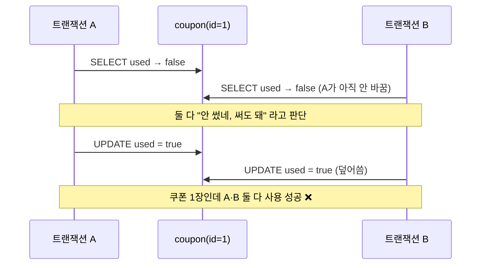
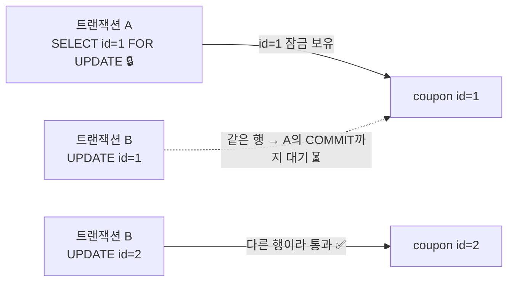
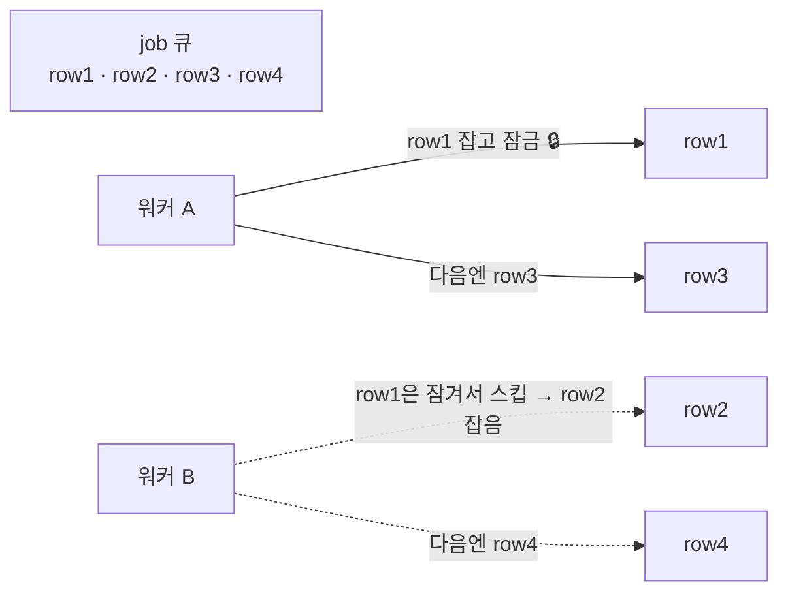
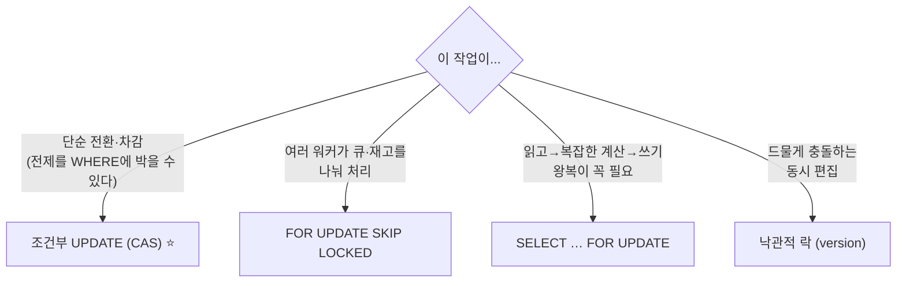

# 동시성 제어 — Race Condition을 막는 4가지 방법

> **대상**: DB 지식이 많지 않은데 ACID·락이 헷갈리는 개발자
> **연관 문서**: [[consistency-model]] · [[outbox-pattern]] · [[perm-version-propagation]]

> 🧪 실제 DB·ORM·운영에서 돌리는 법: [[testing-strategy]] · [[orm-testing-drizzle]]

쿠폰 1장이 있습니다. 두 사람이 **동시에** 같은 쿠폰을 씁니다. 둘 다 "아직 안 썼네?" 하고 읽고, 둘 다 "썼음"으로 바꿉니다. 쿠폰은 1장인데 2명이 할인을 받았습니다. 돈이 샜습니다.

이 한 장면이 이 문서의 전부입니다. 위 사고(race condition)를 막는 도구가 네 가지 있고, 뒤로 갈수록 우리 `platform_db`가 실제로 쓰는 방식에 가까워집니다. 마지막엔 흔한 오해 하나(`Drizzle이 FOR UPDATE를 못 써서 조건부 UPDATE를 쓴다`)를 바로잡습니다. 이 글은 결국 ACID의 **I(Isolation, 고립성)** 를 실무에서 어떻게 구현하느냐의 이야기입니다. ACID 전반·강한 일관성은 [[consistency-model]]에서 다루니 여기선 동시성에만 집중합니다.

---

## Q1. Race condition이 뭔가요? 쿠폰 한 장이 두 번 쓰인다는 게 무슨 말이죠?

**Race condition**(경쟁 상태)은 두 작업이 *동시에* 같은 데이터를 만질 때, 끼어드는 순서에 따라 결과가 망가지는 현상입니다. "race"는 경주 — 두 트랜잭션이 같은 행을 두고 경주하는 그림입니다.

쿠폰 한 장으로 보겠습니다. 코드는 너무 자연스러워 보입니다.

```sql
-- 흔한(그러나 위험한) 패턴: 읽고 → 판단하고 → 쓴다 (read-modify-write)
SELECT used FROM coupon WHERE id = 1;   -- used = false 확인
-- (애플리케이션에서 "안 썼네, 써도 됨" 판단)
UPDATE coupon SET used = true WHERE id = 1;
```

혼자 쓰면 멀쩡합니다. 문제는 사용자 A와 B가 같은 순간에 들어올 때입니다.



A가 읽은 값(`false`)을 토대로 내린 판단이, B의 쓰기 때문에 무효가 됐는데 A는 그걸 모릅니다. 두 UPDATE가 모두 통과합니다. 이걸 **lost update**(갱신 손실)라고 부릅니다 — A의 갱신이 B의 갱신에 묻혀 사라진(혹은 그 반대) 것처럼, 둘 중 하나의 "전제"가 소리 없이 무너집니다.

```
원인 한 줄 요약:
  "읽은 시점"과 "쓰는 시점" 사이에 남이 끼어들 수 있다.
  그 사이에 데이터가 바뀌어도, 내 UPDATE는 그걸 모르고 그냥 덮어쓴다.
```

이건 쿠폰만의 문제가 아닙니다. Seat(좌석) 1개를 둘이 배정, Credit(크레딧) 잔액 차감, 재고 1개를 둘이 구매, 구독 상태 전환 — 전부 같은 모양의 사고입니다. 아래 Q2~Q5는 이 "끼어듦"을 막는 네 가지 도구입니다.

> 💡 **한 줄 요약**: race condition은 두 트랜잭션이 같은 행을 동시에 read-modify-write할 때 끼어듦으로 한쪽 갱신이 묻히는 현상이고(lost update), 쿠폰 1장이 2명에게 쓰이는 게 그 전형입니다.

---

## Q2. 비관적 락(`SELECT … FOR UPDATE`)은 어떻게 막나요? 테이블 전체가 잠기나요?

**비관적 락**(pessimistic lock)의 철학은 한 줄입니다: **"충돌이 날 거다. 그러니 미리 잠그고 시작하자."** 읽는 순간 그 행에 자물쇠를 채워, 내가 끝낼 때까지 남이 못 건드리게 합니다.

PostgreSQL에서는 `SELECT … FOR UPDATE`로 겁니다.

```sql
BEGIN;
  -- 이 행에 쓰기 잠금을 건다. COMMIT까지 다른 트랜잭션은 이 행을 못 바꿈
  SELECT used FROM coupon WHERE id = 1 FOR UPDATE;   -- 🔒 id=1 잠금
  -- (이제 안심하고 판단)
  UPDATE coupon SET used = true WHERE id = 1;
COMMIT;   -- 🔓 여기서 잠금 해제
```

이제 Q1의 사고가 안 납니다. A가 `FOR UPDATE`로 id=1을 잠그면, B의 `SELECT … FOR UPDATE`는 A가 COMMIT할 때까지 **그 줄에서 멈춰 기다립니다**. A가 끝나면 B가 깨어나 다시 읽는데, 이번엔 `used = true`라서 B는 "이미 썼네"로 올바르게 판단합니다.

**가장 흔한 오해: 테이블 전체가 잠긴다? 아닙니다.** `FOR UPDATE`는 **Row Lock**(행 잠금)입니다. 잠그는 건 `WHERE`에 걸린 그 행들뿐입니다.



```
A: BEGIN; SELECT * FROM coupon WHERE id=1 FOR UPDATE;   -- id=1만 잠김
B: UPDATE coupon SET ... WHERE id=2;   → ✅ 즉시 통과 (id=2는 안 잠겼다)
B: UPDATE coupon SET ... WHERE id=1;   → ⏳ A가 COMMIT할 때까지 대기
```

| 항목 | 비관적 락의 특징 |
|---|---|
| 장점 | **안전하다.** read-modify-write 전체를 직렬화 → lost update 원천 차단 |
| 단점 1 | **대기.** 잠긴 행을 노린 다른 트랜잭션은 멈춰 기다림 → 처리량 저하 |
| 단점 2 | **락 경쟁(contention).** 인기 행 하나에 많은 트랜잭션이 몰리면 줄을 섬 |
| 단점 3 | **데드락(deadlock) 가능.** A가 행1→행2 순서로, B가 행2→행1 순서로 잠그면 서로 무한 대기 (PostgreSQL이 감지해 한쪽을 abort) |

> 🐬 **MySQL이라면**: InnoDB도 `SELECT … FOR UPDATE`를 동일하게 지원합니다(행 잠금). 단, 잠그려는 컬럼에 인덱스가 없으면 인접 범위까지 잠그는 갭 락이 걸려 의도보다 넓게 잠길 수 있으니 `WHERE` 컬럼 인덱스를 확인하세요.

> 💡 **한 줄 요약**: 비관적 락(`SELECT … FOR UPDATE`)은 읽는 순간 그 **행만** 잠가(테이블 전체 아님) COMMIT까지 남이 못 바꾸게 합니다. 안전하지만 대기·락 경쟁·데드락이라는 비용이 있습니다.

---

## Q3. 낙관적 락(version 컬럼)은 뭐가 다른가요? 잠그지도 않는데 어떻게 안전하죠?

**낙관적 락**(optimistic lock)의 철학은 정반대입니다: **"충돌은 드물다. 일단 진행하고, 저장할 때 들켰으면 그때 재시도하자."** 미리 잠그지 않습니다. 읽기는 완전히 자유입니다.

대신 행마다 **version 컬럼**을 둡니다. 저장할 때 "내가 읽었던 그 version 그대로냐"를 `WHERE`로 확인합니다.

```sql
-- 1) 읽기: 잠그지 않고 그냥 읽는다. version도 함께 들고 온다
SELECT data, version FROM document WHERE id = 1;   -- 예: version = 5

-- 2) (애플리케이션에서 자유롭게 편집)

-- 3) 저장: "내가 본 version=5가 아직 그대로일 때만" 쓴다
UPDATE document SET data = ?, version = 6
 WHERE id = 1 AND version = 5;
-- 영향 행 1 → 성공 (아무도 안 건드림)
-- 영향 행 0 → 내가 읽은 뒤 누군가 먼저 바꿔 version이 6이 됨 → 충돌! 재시도
```

핵심은 **영향 행 수(affected rows)** 입니다. 두 사람이 동시에 version=5를 읽고 둘 다 저장을 시도하면, 먼저 도착한 쪽이 version을 6으로 올려버립니다. 늦은 쪽의 `WHERE … AND version = 5`는 더 이상 매칭되지 않아 **0행**이 됩니다. 0행을 본 쪽은 "누가 먼저 바꿨구나" 하고 **다시 읽어서 재시도**합니다. 비관적 락처럼 기다리지 않고, 충돌을 *사후에* 감지합니다.

```
비관적 락 : "혹시 모르니 미리 잠그자"  → 대기로 충돌을 예방
낙관적 락 : "괜찮을 거야, 저장 때 확인" → 0행이면 재시도로 충돌을 사후 처리
```

> 💡 우리 `perm_version`이 이 계열의 **사촌**입니다. 권한이 바뀔 때마다 `organization.perm_version`을 +1 해 두고, 토큰 안의 version과 서버 version이 다르면 "낡았다"고 판단해 토큰을 강제 갱신합니다(self-healing 전파). version 숫자로 "내가 본 게 최신이냐"를 가리는 발상이 똑같습니다. 다만 perm_version은 *쓰기 충돌 차단*이 아니라 *stale 토큰 감지·전파*가 목적이라 용도가 다릅니다 — 자세히는 [[perm-version-propagation]].

낙관적 락은 **충돌이 드물 때** 최고입니다. 평소엔 락 비용이 0이고, 어쩌다 충돌할 때만 재시도 비용을 냅니다. 반대로 충돌이 잦으면 재시도가 폭주해 오히려 비효율적입니다(그땐 비관적 락이 낫습니다).

> 💡 **한 줄 요약**: 낙관적 락은 잠그지 않고 version 컬럼만 두었다가, 저장 시 `WHERE version = 읽었던값`으로 확인해 영향 행이 0이면(=남이 먼저 바꿈) 재시도합니다. 충돌이 드문 동시 편집에 적합합니다.

---

## Q4. 조건부 UPDATE(Compare-And-Set)는 뭔가요? 우리 billing이 이걸 쓴다는데 왜죠?

**조건부 UPDATE**(Compare-And-Set, CAS / atomic UPDATE)는 SaaS·billing에서 **가장 흔하게** 쓰는 방식이고, `platform_db`의 상태 전환 대부분이 이것입니다.

발상은 이렇습니다. Q1의 사고는 "읽기"와 "쓰기"가 **떨어져 있어서** 그 사이에 끼어듦이 생겼습니다. 그러면 **읽기+판단+쓰기를 한 문장으로 합쳐버리면** 끼어들 틈이 사라집니다. DB는 단일 UPDATE 문 안의 조건 확인과 수정을 **원자적으로**(쪼갤 수 없이) 처리하기 때문입니다.

쿠폰으로 돌아가 봅시다. Q1의 위험한 `SELECT` + `UPDATE` 두 문장을, 조건을 `WHERE`에 박은 **한 문장**으로 바꿉니다.

```sql
-- 읽고-판단-쓰기를 한 문장으로. "아직 안 썼을 때만 쓴다"
UPDATE coupon SET used = true
 WHERE id = 1 AND used = false;   -- ← 전제(used=false)를 WHERE에 박음
-- 영향 행 1 → 성공 (내가 1장을 잡았다)
-- 영향 행 0 → 이미 누가 썼다 → PRECONDITION_FAILED (409)
```

두 사람이 동시에 이 문장을 날려도, DB가 같은 행에 대한 두 UPDATE를 직렬화합니다. 먼저 도달한 쪽이 `used`를 `true`로 바꾸면, 늦은 쪽의 `WHERE … AND used = false`는 더 이상 매칭되지 않아 **0행**입니다. 별도 `SELECT`도, 락 대기도 없이 race가 사라집니다.

이게 **우리 billing 상태 전환의 표준**입니다(architecture 불변식 #12). 기대 상태를 `WHERE`에 박고, 영향 행 수로 성공/전제 위반을 가립니다.

```sql
-- 구독 상태 전환: "지금 ACTIVE일 때만 PAST_DUE로"
UPDATE org_subscription SET status = 'PAST_DUE'
 WHERE pk = $1 AND status = 'ACTIVE';   -- 기대 상태를 WHERE에
-- 영향 행 0 → 이미 다른 상태로 전환됨 → PRECONDITION_FAILED (409)
```

```typescript
// 영향 행 수로 전제 검증 (Drizzle, node-postgres)
const rows = await tx
  .update(orgSubscription)
  .set({ status: "PAST_DUE" })
  .where(and(eq(orgSubscription.pk, pk), eq(orgSubscription.status, "ACTIVE")))
  .returning({ pk: orgSubscription.pk });
if (rows.length === 0) throw new PreconditionFailedError("expected ACTIVE"); // 409
```

> 🐬 **MySQL이라면**: 영향 행 수를 `.returning()` 대신 `result.affectedRows`로 읽고(`as unknown as` 캐스트가 필요할 수 있음), 나머지 발상은 동일합니다.

**언제 1순위인가?** Seat 할당, Credit 차감, Coupon 사용, Quota 차감, 상태 전환처럼 **"읽고-계산하고-쓰는 왕복이 필요 없는 단순 전환"** 에 최적입니다. 전제(기대 상태/현재 값)를 `WHERE`에 표현할 수 있다면, 락 대기도 별도 읽기도 없이 한 문장으로 race를 제거합니다. 비관적 락보다 가볍고, 낙관적 락처럼 version 컬럼을 따로 둘 필요도 없습니다(상태 컬럼 자체가 전제 역할).

> 💡 **한 줄 요약**: 조건부 UPDATE(CAS)는 전제를 `WHERE`에 박아 읽기·판단·쓰기를 한 원자적 문장으로 합쳐 race를 없앱니다. 영향 행 1=성공, 0=전제 위반. 우리 billing 상태 전환의 표준 방식입니다(불변식 #12).

---

## Q5. `FOR UPDATE SKIP LOCKED`는 또 뭔가요? 이게 낙관적 락인가요?

아닙니다. **`FOR UPDATE SKIP LOCKED`는 여전히 락**입니다 — 비관적 락의 변형이지 낙관적 락이 아닙니다. Q2의 `FOR UPDATE`에 한 가지 규칙을 더한 것뿐입니다: **"이미 잠긴 행은 기다리지 말고 건너뛰어라."**

Q2에서 B는 A가 잠근 행을 만나면 *기다렸습니다*. `SKIP LOCKED`는 기다리는 대신 그 행을 **무시하고 다음 행으로** 넘어갑니다.

```sql
-- 워커가 처리할 일감을 집는다. 남이 이미 집은 건 건너뛴다
SELECT * FROM job
 WHERE status = 'PENDING'
 ORDER BY created_at
 LIMIT 1
 FOR UPDATE SKIP LOCKED;   -- 🔒 잡되, 잠긴 행은 대기 없이 스킵
```

이게 강력한 건 **워커를 여러 개 띄울 때**입니다. 워커 N개가 같은 큐(또는 재고) 테이블을 동시에 읽어도, `SKIP LOCKED` 덕에 **서로 겹치지 않게 행을 나눠 가집니다**.



```
워커 A: ... FOR UPDATE SKIP LOCKED  → row1을 잡음 (잠금)
워커 B: ... FOR UPDATE SKIP LOCKED  → row1은 잠겼으니 스킵 → row2를 잡음
→ 두 워커가 같은 일을 중복 처리하지 않고, 대기도 없이 처리량이 N배
```

**Shopify의 재고 예시**가 직관적입니다. 인기 상품 재고를 `qty = 1`이라는 *숫자 하나*로 관리하면, 그 한 행에 모든 주문이 몰려 락 경쟁이 극심합니다(Q2 단점). Shopify는 재고를 `qty=10` 대신 `inventory_unit_1, inventory_unit_2, … inventory_unit_10`처럼 **개별 Row 단위**로 쪼개 두고, 주문이 들어오면 `FOR UPDATE SKIP LOCKED`로 *아직 안 잠긴 unit 하나*를 집습니다. 동시 주문 10개가 서로 다른 unit을 잡아 대기 없이 병렬 처리되니 동시성이 확 올라갑니다.

**우리 outbox 워커가 정확히 이 방식**입니다. 여러 워커가 `outbox_event` 테이블의 `PENDING` 행을 `FOR UPDATE SKIP LOCKED`로 나눠 가져가, 한 이벤트를 두 워커가 중복 처리하지 않습니다 — 자세히는 [[outbox-pattern]].

```
정리:
  Q2 FOR UPDATE              : 잠긴 행을 만나면 → 기다린다 (상태 전환 직렬화용)
  Q5 FOR UPDATE SKIP LOCKED  : 잠긴 행을 만나면 → 건너뛴다 (워커 간 작업 분배용)
  둘 다 "락"이다. SKIP LOCKED는 낙관적 락이 아니다.
```

> 🐬 **MySQL이라면**: MySQL 8.0+도 `SELECT … FOR UPDATE SKIP LOCKED`를 동일하게 지원합니다.

> 💡 **한 줄 요약**: `FOR UPDATE SKIP LOCKED`는 비관적 락 + "잠긴 행은 대기 없이 스킵"으로, 워커 N개가 큐·재고 행을 겹치지 않게 나눠 가져 처리량을 올립니다. 낙관적 락이 아니라 여전히 락이며, 우리 outbox 워커가 이걸 씁니다.

---

## Q6. "Drizzle이 `FOR UPDATE`를 못 써서 조건부 UPDATE를 쓴다"던데, 맞나요?

**틀린 설명입니다.** 자주 도는 오해라 여기서 바로잡습니다.

```
❌ 오해: "Drizzle이 FOR UPDATE를 미지원해서 어쩔 수 없이 조건부 UPDATE를 쓴다."
✅ 사실: ① Drizzle은 ORM일 뿐이고 FOR UPDATE를 표현할 수 있다.
        ② PostgreSQL·MySQL 모두 FOR UPDATE·SKIP LOCKED를 네이티브로 지원한다.
        ③ 조건부 UPDATE를 택한 건 "불가능해서"가 아니라 "더 적합해서"다.
```

먼저 사실관계입니다. `FOR UPDATE`·`FOR UPDATE SKIP LOCKED`는 **PostgreSQL과 MySQL 양쪽 모두의 네이티브 SQL 기능**입니다(Q2·Q5에서 봤듯이). 그리고 **Drizzle은 ORM**이라 이걸 그대로 표현할 수 있습니다.

```typescript
// Drizzle에서 FOR UPDATE는 .for('update')로 표현된다 — 미지원이 아니다
const rows = await tx
  .select()
  .from(coupon)
  .where(eq(coupon.id, 1))
  .for("update");                 // → SELECT ... FOR UPDATE

// SKIP LOCKED도 옵션으로 표현 가능
//   .for("update", { skipLocked: true })   → SELECT ... FOR UPDATE SKIP LOCKED
// 정 안 되면 db.execute(sql`... FOR UPDATE SKIP LOCKED`)로 raw SQL도 쓸 수 있다
```

그러니 우리가 단순 상태 전환에 조건부 UPDATE를 쓰는 이유는 "FOR UPDATE가 불가능해서"가 **아닙니다**. **단순 상태 전환엔 조건부 UPDATE가 더 적합하기 때문**입니다(Q4):

- `SELECT … FOR UPDATE`는 *읽고 → 판단하고 → 쓰는* 왕복과 **락 대기**가 필요합니다.
- 조건부 UPDATE는 전제를 `WHERE`에 박아 **한 문장**으로 race를 없애므로, 왕복도 락 대기도 없습니다.

즉 도구를 *못 써서*가 아니라, *일에 맞는 도구를 골라서*입니다. (만약 vault 다른 문서에 "Drizzle FOR UPDATE 미지원" 같은 서술이 남아 있다면 그건 이 문서가 바로잡는 대상입니다 — 단, 다른 파일은 수정하지 않고 여기서만 정정합니다.)

> 💡 **한 줄 요약**: Drizzle은 `FOR UPDATE`를 `.for('update')`로 표현할 수 있고 PostgreSQL·MySQL 모두 이를 네이티브 지원합니다. 조건부 UPDATE를 택한 건 미지원 때문이 아니라, 단순 상태 전환엔 한 문장으로 race를 없애는 쪽이 더 적합하기 때문입니다.

---

## Q7. 그래서 언제 뭘 써야 하나요? (선택 가이드)

네 도구를 한눈에 비교합니다. 같은 race를 막더라도 *상황*에 따라 1순위가 다릅니다.



| 방식 | 철학 | 잠그나? | 쓰는 곳(우리 시스템) | 1순위 상황 |
|---|---|---|---|---|
| **조건부 UPDATE (CAS)** | 한 문장으로 합쳐 끼어듦 제거 | ✕ (원자적 UPDATE) | **billing 상태 전환**(불변식 #12) | Seat 할당·Credit 차감·Coupon 사용·Quota 차감·상태 전환 |
| **`FOR UPDATE`** | 미리 잠그고 시작 | ◯ (행, 대기) | 복잡한 read-modify-write 직렬화 | 읽고→계산→수정 왕복이 필요한 경우 |
| **`FOR UPDATE SKIP LOCKED`** | 잠그되 잠긴 건 스킵 | ◯ (행, 스킵) | **outbox 워커**([[outbox-pattern]]) | Job queue·대량 예약·재고 경쟁(워커 분배) |
| **낙관적 락 (version)** | 일단 진행, 저장 때 확인 | ✕ (version 비교) | `perm_version`은 사촌([[perm-version-propagation]]) | 드물게 충돌하는 동시 편집 |

```
빠른 판단 트리:
  전제를 WHERE 한 줄로 표현 가능?         → 조건부 UPDATE (1순위)
  여러 워커가 큐/재고를 나눠 가져야?       → SKIP LOCKED
  읽고-복잡한-계산-쓰기 왕복이 꼭 필요?    → FOR UPDATE
  거의 안 부딪히는 동시 편집?              → 낙관적 락(version)
```

> 💡 **한 줄 요약**: 단순 전환·차감은 조건부 UPDATE가 1순위, 복잡한 read-modify-write는 `FOR UPDATE`, 워커 분배는 `SKIP LOCKED`, 드문 동시 편집은 낙관적 락입니다.

---

## Q8. 이게 ACID와 무슨 상관인가요?

이 글의 네 도구는 결국 ACID의 **I(Isolation, 고립성)** 를 실무에서 구현하는 방법들입니다.

```
A - Atomicity   (원자성): 전부 또는 전무
C - Consistency (일관성): 제약(NOT NULL·UNIQUE·FK)이 항상 유효
I - Isolation   (고립성): 동시 트랜잭션이 서로의 중간 상태를 안 본다  ← 이 글의 주제
D - Durability  (지속성): COMMIT되면 크래시에도 남는다
```

Q1의 lost update는 정확히 **고립성이 깨진** 사고입니다 — A가 B의 중간 상태(아직 안 바뀐 값)를 보고 잘못 판단했습니다. 비관적 락·낙관적 락·조건부 UPDATE·SKIP LOCKED는 모두 "동시 트랜잭션이 서로를 어디까지·어떻게 못 보게 할 것인가"를 다루는, 고립성 구현 도구입니다.

ACID 전반과 원자성(Atomicity), 강한 일관성(strong consistency)·왜 단일 트랜잭션인지는 [[consistency-model]]에서 다룹니다. 이 문서는 그중 **I 하나**를 깊게 판 것이라, 중복 설명 대신 그쪽으로 링크합니다.

> 💡 **한 줄 요약**: 이 글의 네 도구는 ACID의 I(고립성) 구현 방법이고, lost update는 고립성이 깨진 사고입니다. A·C·D와 강한 일관성은 [[consistency-model]]을 보세요.

---

## 용어 정리

| 용어 | 영어 | 뜻 | 우리 시스템에서 |
|---|---|---|---|
| 경쟁 상태 | race condition | 동시에 같은 데이터를 만져 끼어듦 순서로 결과가 망가짐 | 쿠폰 1장이 2명에게 쓰임 |
| 갱신 손실 | lost update | 두 갱신 중 한쪽 전제가 묻혀 덮어써짐 | read-then-UPDATE의 전형적 사고 |
| read-modify-write | — | 읽고→판단→쓰는 3단계 (그 사이에 끼어듦 가능) | 위험 패턴, 직렬화 필요 |
| 비관적 락 | pessimistic lock | "충돌난다 가정, 미리 잠금" | `SELECT … FOR UPDATE` |
| 행 잠금 | row lock | 테이블 전체가 아니라 해당 행만 잠금 | `FOR UPDATE`가 잠그는 단위 |
| 낙관적 락 | optimistic lock | "충돌 드물다 가정, 저장 때 version 확인" | `perm_version`이 사촌 |
| 조건부 UPDATE / CAS | compare-and-set | 전제를 WHERE에 박아 한 원자적 문장으로 처리 | billing 상태 전환(불변식 #12) |
| 영향 행 수 | affected rows | UPDATE가 실제로 바꾼 행 수(1=성공, 0=전제 위반) | `.returning()` 길이 / `rowCount` |
| SKIP LOCKED | — | 잠긴 행을 대기 없이 건너뜀(여전히 락) | outbox 워커 작업 분배 |
| 데드락 | deadlock | 두 트랜잭션이 서로의 락을 기다려 무한 대기 | PostgreSQL이 감지해 한쪽 abort |
| 고립성 | Isolation (ACID) | 동시 트랜잭션이 서로 중간 상태를 안 봄 | 이 글 전체의 주제 |

---

## 테스트 방법

> 🧪 *실제 DB·ORM·운영에서 돌리는 법*: [[testing-strategy]] · [[orm-testing-drizzle]]

PostgreSQL 16 + Testcontainers(`PostgreSqlContainer`) + Drizzle(node-postgres) + vitest로, 세 방식이 race를 실제로 막는지 검증합니다. 인메모리 SQLite로는 동시성·락을 못 본떠서 **반드시 실제 PostgreSQL 컨테이너**를 띄웁니다.

**① 조건부 UPDATE (CAS)** — (a) 잘못된 전제 → 0행, (b) 동시 2 트랜잭션 → 1개만 성공.

```typescript
import { describe, it, expect, beforeEach } from "vitest";
import { and, eq } from "drizzle-orm";

describe("조건부 UPDATE로 쿠폰 1장이 2번 안 쓰인다 (CAS)", () => {
  beforeEach(async () => {
    await db.delete(coupon);
    await db.insert(coupon).values({ id: 1, used: false });
  });

  const useCoupon = () =>
    db
      .update(coupon)
      .set({ used: true })
      .where(and(eq(coupon.id, 1), eq(coupon.used, false))) // 전제를 WHERE에
      .returning({ id: coupon.id });

  it("(a) 잘못된 전제(이미 사용됨) → 영향 행 0", async () => {
    await db.update(coupon).set({ used: true }).where(eq(coupon.id, 1)); // 미리 사용
    const rows = await useCoupon();
    expect(rows.length).toBe(0); // rowCount 0 = PRECONDITION_FAILED
  });

  it("(b) 동시 2 트랜잭션 → 정확히 1개만 성공", async () => {
    const [r1, r2] = await Promise.all([useCoupon(), useCoupon()]);
    const succeeded = [r1, r2].filter((r) => r.length === 1);
    expect(succeeded).toHaveLength(1); // 한 명만 1행, 다른 한 명은 0행
  });
});
```

> 🐬 **MySQL이라면**: `.returning()` 대신 `result.affectedRows`(필요 시 `as unknown as` 캐스트)로 영향 행 수를 확인합니다 — 이 한 줄만 다릅니다.

**② `FOR UPDATE`** — A가 행을 잠근 동안 B가 **대기**하는지. A의 트랜잭션을 열어둔 채 B를 시작해, A가 COMMIT하기 전까지 B가 진행하지 못함을 확인합니다.

```typescript
it("FOR UPDATE: A가 id=1을 잠그면 B는 A의 COMMIT까지 대기한다", async () => {
  let bAcquiredAt = 0;
  await db.transaction(async (txA) => {
    await txA.select().from(coupon).where(eq(coupon.id, 1)).for("update"); // 🔒 A 잠금

    // B는 같은 행을 잠그려다 막힘 — A가 COMMIT하기 전엔 못 들어옴
    const bPromise = db.transaction(async (txB) => {
      await txB.select().from(coupon).where(eq(coupon.id, 1)).for("update");
      bAcquiredAt = Date.now();
    });

    // A가 잡고 있는 동안엔 B가 아직 락을 못 잡았어야 한다
    await new Promise((r) => setImmediate(r));
    expect(bAcquiredAt).toBe(0); // B는 여전히 대기 중
    // (txA 콜백이 끝나면 A COMMIT → B가 깨어남)
    return bPromise; // A COMMIT 후 B 완료를 기다림
  });
  expect(bAcquiredAt).toBeGreaterThan(0); // A COMMIT 뒤에야 B가 락 획득
});
```

**③ `FOR UPDATE SKIP LOCKED`** — 워커 2개가 PENDING 행을 **겹치지 않게** 가져가는지. `job`에 2행을 넣고 두 트랜잭션이 각각 `LIMIT 1 FOR UPDATE SKIP LOCKED`로 집으면 서로 다른 행을 잡아야 합니다.

```typescript
it("SKIP LOCKED: 워커 2개가 서로 다른 PENDING 행을 가져간다", async () => {
  await db.insert(job).values([{ id: 1 }, { id: 2 }]); // 둘 다 PENDING

  const grab = (tx: typeof db) =>
    tx.execute(sql`
      SELECT id FROM job WHERE status = 'PENDING'
      ORDER BY id LIMIT 1 FOR UPDATE SKIP LOCKED`);

  // 두 트랜잭션을 동시에 열어 각각 한 행씩 집게 한다
  const picked: number[] = [];
  await Promise.all([
    db.transaction(async (tx) => { picked.push((await grab(tx))[0]?.id); }),
    db.transaction(async (tx) => { picked.push((await grab(tx))[0]?.id); }),
  ]);
  // 같은 행을 둘이 집지 않음 → {1, 2} 두 개가 겹치지 않게 나뉨
  expect(new Set(picked)).toEqual(new Set([1, 2]));
});
```

**체크리스트** — 새 동시성 흐름을 만들 때:

```
[ ] read-then-UPDATE(락 없는 SELECT 후 UPDATE)를 쓰고 있지 않은가?
[ ] 단순 상태 전환·차감이면 조건부 UPDATE로 전제를 WHERE에 박았는가?
[ ] 영향 행 수(0/1)로 성공·전제 위반을 검증하는가?
[ ] 워커 다중화면 FOR UPDATE SKIP LOCKED로 행을 나눠 가지는가?
[ ] 동시 2 트랜잭션 테스트로 "1개만 성공"이 단언되는가? (실제 PostgreSQL 컨테이너로)
```

---

## 마치며

동시성 제어는 결국 한 질문입니다: **"읽은 시점과 쓰는 시점 사이에 남이 끼어들면 어떻게 되나?"** 쿠폰 1장이 2명에게 쓰이는 사고(lost update)가 그 답이 비어 있을 때 벌어지는 일입니다.

네 가지 도구는 같은 race를 서로 다른 철학으로 막습니다.

- **비관적 락(`FOR UPDATE`)**: 미리 잠근다. 안전하지만 대기·데드락 비용. 복잡한 read-modify-write에.
- **낙관적 락(version)**: 일단 진행, 저장 때 version으로 확인·재시도. 드문 동시 편집에. (`perm_version`이 사촌)
- **조건부 UPDATE(CAS)**: 전제를 `WHERE`에 박아 한 문장으로 끝낸다. **우리 billing 상태 전환의 표준**(불변식 #12).
- **`FOR UPDATE SKIP LOCKED`**: 잠그되 잠긴 건 스킵해 워커가 나눠 가진다. **우리 outbox 워커**가 이 방식.

"Drizzle이 FOR UPDATE를 못 써서 조건부 UPDATE를 쓴다"는 틀린 말입니다. 둘 다 가능하고, *일에 맞는 도구를 고른 것*뿐입니다 — 단순 전환엔 조건부 UPDATE가 가장 가볍게 race를 없앱니다. 그리고 이 모든 게 ACID의 I(고립성)를 실무에서 구현하는 이야기입니다. 나머지 ACID와 강한 일관성은 [[consistency-model]]로 이어집니다.

---

## 연결된 개념

- [[consistency-model|일관성 모델]] — ACID 전반·원자성·강한 일관성·왜 단일 트랜잭션인지 (이 글은 그중 I 하나를 판 것)
- [[outbox-pattern|Outbox 패턴]] — `FOR UPDATE SKIP LOCKED`로 워커가 PENDING 이벤트를 나눠 가져가는 실제 사례
- [[perm-version-propagation|perm_version 전파]] — 낙관적 락의 사촌. version 숫자로 stale 토큰을 감지·자가치유
- [[idempotency-key|멱등성 키]] — at-least-once 처리의 중복을 흡수하는 짝꿍 장치
- [[subscription-lifecycle|구독 라이프사이클]] — 조건부 UPDATE로 직렬화되는 상태 전환들
> 소스 문서
- [[architecture]] — 불변식 #12 (상태 전환 직렬화: 조건부 UPDATE / `WHERE 기대상태` + 영향 행 검증)
- [[schema-reference]] — billing 상태 전환·outbox_event DDL
