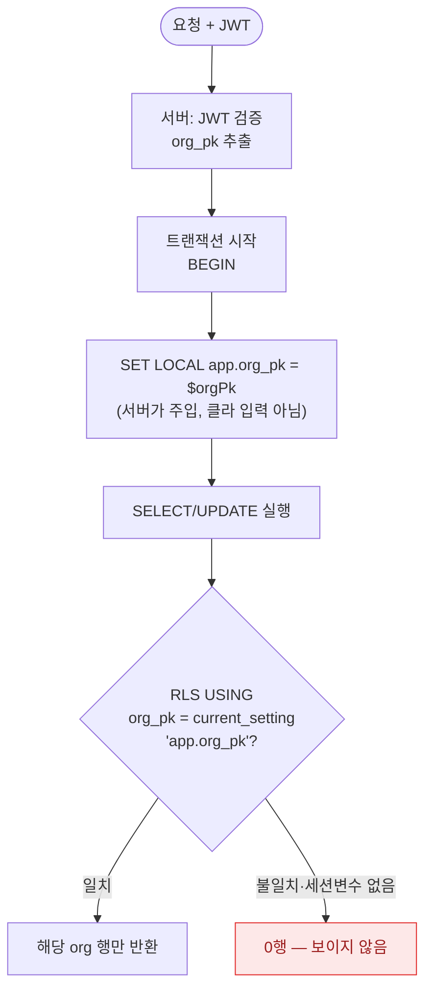

# Pool 모델 멀티테넌시와 RLS 개념 설명

> **대상**: DB 지식이 많지 않은 개발자
> **연관 문서**: [[architecture|architecture.md §1.4]] · [[schema-reference|schema-reference.md §G]]

"멀티테넌트", "RLS", "Pool 모델" — `platform_db` 코드를 처음 보면 이 단어들이 낯설게 느껴집니다. 이 문서는 우리 시스템이 왜 이 구조를 택했고, 어떻게 테넌트 간 데이터를 격리하는지 설명합니다.

---

## Q1. 멀티테넌트(multi-tenant)가 뭔가요? 왜 org마다 DB를 따로 안 쓰나요?

**멀티테넌트**는 하나의 시스템에 여러 고객(테넌트)이 공존하는 구조입니다. 여기서 테넌트는 `organization` — 즉, 각 학원이나 회사입니다.

비유를 들면 이렇습니다. 아파트 한 동에 여러 세대가 살지만, 세대마다 건물을 따로 짓지 않습니다. 각 호수가 독립된 공간을 갖되 건물 인프라(엘리베이터, 배관 등)는 공유합니다. 멀티테넌트 DB도 같습니다.

**왜 org마다 DB를 따로 안 쓰나요?**

"DB-per-tenant" 방식의 문제점:

```
학원 1개당 DB 1개라면...

학원 100개 → DB 100개 → 커넥션 풀 100개 × 최소 5 = 500개 커넥션
학원 1000개 → DB 1000개 → 커넥션 풀 1000개 × 5 = 5000개 커넥션
                                                      └─ Postgres 서버 폭발
```

- 운영 비용: DB 인스턴스 100개를 각각 백업·모니터링·패치해야 합니다
- 스키마 마이그레이션: 컬럼 하나 추가하면 DB 100개 전부 DDL 실행
- 신규 학원 가입: DB 생성 + 마이그레이션 실행 → 가입 속도 느려짐

그래서 `platform_db`는 **Pool 모델**을 씁니다. 하나의 DB에 모든 학원 데이터가 공존하되, 모든 테이블에 `org_pk` 컬럼을 두어 행(row) 단위로 격리합니다:

```sql
-- 학원 A의 데이터
SELECT * FROM org_entitlement WHERE org_pk = 1 AND service = 'ACADEMY';
--                                  ^^^^^^^^^^^^ 항상 이 조건 필수

-- 학원 B의 데이터
SELECT * FROM org_entitlement WHERE org_pk = 2 AND service = 'ACADEMY';
--                                  ^^^^^^^^^^^^ 다른 학원, 다른 데이터
```

불변식 #3이 이것을 강제합니다:

```
불변식 #3: 모든 도메인 테이블은 org_pk NOT NULL. 예외 없음 — 테넌트 경계는 불변식.
```

> 💡 **한 줄 요약**: DB 하나에 모든 학원 데이터를 담되, 모든 쿼리에 `org_pk` 조건을 붙여서 다른 학원 데이터가 섞이지 않게 합니다.

---

## Q2. RLS(Row-Level Security)가 뭔가요? 들어봤는데 정확히 모르겠어요.

RLS는 "어떤 유저가 어떤 행을 읽을 수 있는지"를 **DB 자체가 정책으로 강제하는** 기능입니다.

비유하자면, 도서관에서 책에다 "이 책은 성인 회원만 볼 수 있음"이라는 라벨을 붙여두면, 사서(앱 코드)가 실수로 책을 꺼내주려 해도 도서관 시스템(DB)이 알아서 막아주는 것과 같습니다. 앱 코드가 "WHERE 조건을 빠뜨려도" DB 레벨에서 이미 필터링이 걸립니다.

PostgreSQL에서 RLS가 어떻게 동작하는지 보면 이해가 쉽습니다:

```sql
-- PostgreSQL에서는 DB 자체가 정책 강제
ALTER TABLE org_entitlement ENABLE ROW LEVEL SECURITY;
CREATE POLICY tenant_isolation ON org_entitlement
  USING (org_pk = current_setting('app.org_pk')::bigint);
-- 이 정책이 있으면, 아무리 앱이 실수해도 다른 org 데이터가 나오지 않음

-- 앱은 트랜잭션마다 현재 org를 세션 변수로 주입한다
SET LOCAL app.org_pk = '1';   -- ← 서버가 JWT에서 해석해 넣음. 클라이언트 입력 금지
```

PostgreSQL의 RLS는 강력한 안전망이자 **1차 강제 메커니즘**입니다. 개발자가 쿼리에서 `WHERE org_pk = ?`를 빠뜨려도, DB가 현재 세션의 `app.org_pk` 설정값으로 자동 필터를 추가합니다. "사서가 책을 주려 해도 잠금 장치가 막는" 구조입니다.

여기서 핵심은 `app.org_pk`를 **누가 채우느냐**입니다. 클라이언트가 보낸 값을 그대로 넣으면 위조될 수 있으므로, 서버가 JWT를 검증한 뒤 그 안의 org를 `SET LOCAL app.org_pk = $orgPk`로 트랜잭션마다 주입합니다. 클라이언트 입력은 절대 이 값에 닿지 않습니다.

요청 한 건이 RLS 안에서 어떻게 흐르는지 그림으로 보면 다음과 같습니다.



`SET LOCAL`을 빠뜨린 경로가 있으면 `app.org_pk`가 비어 정책이 매칭 0행을 내므로(fail-closed), 데이터가 새기보다 *안 보이는* 쪽으로 닫힙니다.

> 💡 **한 줄 요약**: RLS는 앱 코드 실수와 상관없이 DB 자체가 "당신은 이 행만 볼 수 있어요"를 강제하는 DB 레벨 보안 기능입니다.

---

## Q3. org 격리는 무엇이 강제하나요? RLS 하나로 충분한가요?

PostgreSQL은 RLS로 **DB에서 직접** 테넌트 격리를 강제합니다(Q2). 이게 1차 메커니즘입니다. 그렇다고 앱 레이어를 손 놓는다는 뜻은 아닙니다 — RLS와 **함께** 앱 레이어 강제를 두는 것이 정석(defense-in-depth)입니다.

> 🐬 **MySQL이라면**: MySQL 8은 RLS를 지원하지 않습니다. MySQL 인프라를 써야 한다면 RLS 자리를 아래 앱 레이어 3 방어선이 **대체**합니다(Gate 함수 파라미터 강제 + NOT NULL 스키마 + CI 린트). PG에서는 이 3 방어선이 RLS를 *대체*하는 게 아니라 *보강*합니다.

그래서 PG에서도 다음 세 가지를 RLS 위에 함께 둡니다. RLS가 DB의 마지막 방어선이라면, 이들은 그 앞단에서 앱 버그를 봉쇄하고 의도를 코드로 명시하는 **defense-in-depth** 층입니다.

**방어선 1: [[gate-abc-flow|Gate A]] 함수에 orgPk 파라미터 필수화**

```typescript
// 앱에서 강제 — 모든 Gate 함수에 orgPk 필수 파라미터
const entitlement = await getEntitlementByService(orgPk, service);
//                                                 ↑↑↑↑↑↑ 없으면 함수 자체가 동작 안 함

// 함수 시그니처 자체가 orgPk를 강제
async function getEntitlementByService(
  orgPk: number,   // ← 이게 없으면 TypeScript 컴파일 오류
  service: EntitlementService
): Promise<OrgEntitlement | null> {
  return db.query.orgEntitlement.findFirst({
    where: and(
      eq(orgEntitlement.orgPk, orgPk),  // ← 항상 포함
      eq(orgEntitlement.service, service)
    )
  });
}
```

**방어선 2: 스키마 레벨 NOT NULL 강제**

```sql
-- 모든 도메인 테이블의 org_pk는 NOT NULL
CREATE TABLE org_entitlement (
  org_pk [[pk-ulid-strategy|BIGINT pk]] NOT NULL,  -- ← NULL이면 INSERT 자체 실패
  ...
);
```

**방어선 3: CI 린트 (P1 — 현재 미구현, 곧 추가 예정)**

```typescript
// 금지 패턴 (P1 CI 린트로 차단 예정)
// 이런 쿼리가 코드에 있으면 빌드 실패
SELECT * FROM org_entitlement WHERE service = 'ACADEMY'; -- org_pk 누락!
```

RLS + 세 방어선의 효과:

```
방어선         │ 막는 것
───────────────┼──────────────────────────────────
RLS 정책        │ 앱이 WHERE org_pk를 빠뜨려도 DB가 자동 필터 (1차 강제)
NOT NULL       │ 삽입 시 org_pk 누락 → DB 오류
Gate 함수 시그니처 │ 함수 호출 시 orgPk 빠뜨리면 → 타입 오류
CI 린트 (P1)  │ 리뷰 전에 빌드 단계에서 → 차단
```

RLS 하나로도 격리는 강제되지만, 그 앞단에 앱 강제를 겹쳐 둡니다 — 앱 버그를 더 일찍(컴파일·빌드 단계) 잡고, "이 쿼리는 테넌트 경계를 의식한다"는 의도를 코드에 명시하기 위해서입니다.

> 💡 **한 줄 요약**: PG는 RLS로 DB에서 격리를 1차 강제하고, 그 위에 Gate 함수 파라미터 강제 + NOT NULL 스키마 + CI 린트를 defense-in-depth로 겹칩니다. (🐬 MySQL 인프라라면 RLS 자리를 이 3 방어선이 대체)

---

## Q4. SUPER_ADMIN은 여러 org 데이터를 봐야 하는데, 격리를 어떻게 하나요?

`platform_db`는 SUPER_ADMIN role 자체를 거부합니다([[cross-tenant-separation]]). 대신 **아키텍처 분리** 방식을 씁니다.

일반 비즈니스 로직과 운영 집계를 **코드 위치로 분리**합니다:

```
일반 모듈 (academy-api, agent-api...)
  └── 항상 org_pk 필수. 다른 org 데이터 접근 불가

internal/ 모듈 또는 *-admin 서비스 (별도 인증, 내부망만 접근)
  └── raw SQL로 cross-tenant 조회 가능
  └── 외부 라우팅에 노출 금지
  └── 감사 로그 별도 기록
```

예를 들어 "전체 학원 가입 현황을 집계하는 관리자 기능"은 이렇게 분리됩니다:

```typescript
// ❌ 일반 코드에서 org_pk 없이 조회 — 금지
const allOrgs = await db.query.organization.findMany();  // 전 테넌트 노출

// ✅ internal/ 모듈에서만 가능 (별도 인증 필요)
// apps/admin-api/src/internal/org-stats.service.ts
const stats = await db.execute(sql`
  SELECT COUNT(*) as total_orgs, org.type
  FROM organization org
  GROUP BY org.type
`);  // raw SQL로 의도를 코드 위치로 드러냄
```

**왜 SUPER_ADMIN role을 거부하나요?**

Admin role이 있으면:
1. 탈취 시 전 테넌트 데이터 노출 (단일 장애점)
2. 비즈니스 로직 코드에 보안 우회 코드가 섞임
3. "이 개발자는 Admin이니까 org_pk 없이 조회해도 되겠지" 관례가 생김

코드 위치로 분리하면 cross-tenant 조회가 어디에 있는지 grep 한 줄로 찾을 수 있고, 접근 권한도 별도로 제어할 수 있습니다.

(PG라면 `CREATE POLICY admin_override ... USING (current_setting('app.role') = 'SUPER_ADMIN')` 같은 RLS 우회 정책으로 처리할 수도 있으나, 우리는 우회 권한을 정책에 심는 대신 **코드 위치 분리**를 택합니다 — 보안 우회 경로를 정책이 아니라 grep 가능한 모듈 경계로 드러내기 위해서입니다.)

> 💡 **한 줄 요약**: SUPER_ADMIN role은 없습니다. cross-tenant 조회는 `internal/` 모듈이나 별도 admin 서비스에서만 가능하고, 코드 위치 자체가 접근 통제선입니다.

---

## Q5. 실수로 쿼리에서 `org_pk` 조건을 빠뜨리면 어떻게 되나요? 막을 방법이 있나요?

PG에서는 `org_pk` 조건을 빠뜨려도 **RLS 정책이 DB에서 자동으로 필터**를 겁니다(Q2) — 현재 세션의 `app.org_pk`에 해당하는 행만 보입니다. 즉 1차 안전망은 DB가 이미 들고 있습니다.

그런데 왜 그래도 앱 레이어 강제를 유지할까요? **defense-in-depth** 때문입니다. RLS는 "세션 변수가 올바르게 세팅됐다"를 전제로 동작하므로, `SET LOCAL app.org_pk`를 빠뜨린 코드 경로가 있으면 격리가 무너질 수 있습니다. 앱 강제(아래)는 그런 빈틈을 컴파일·빌드 단계에서 미리 막고, "이 쿼리는 테넌트 경계를 의식한다"는 의도를 코드에 남깁니다.

> 🐬 **MySQL이라면**: RLS가 없으므로 자동 필터도 없습니다. `org_pk` 누락 = 다른 학원 데이터 노출이라, 아래 앱 강제가 *유일한* 방어선이 됩니다.

**현재 구현된 방어:**

```typescript
// @platform-db 패키지의 모든 게이트 함수는 orgPk를 필수 파라미터로 받음
// → TypeScript 컴파일러가 빠뜨리면 오류

export async function getActiveMembership(
  userPk: number,
  orgPk: number  // ← 빠뜨리면 컴파일 오류
): Promise<Membership | null>

export async function checkGateB(
  orgPk: number,  // ← 빠뜨리면 컴파일 오류
  service: EntitlementService = "ACADEMY"
): Promise<void>
```

**자가진단 DoD (Definition of Done):**

```
① 개발자가 org_pk 빠뜨리면 다른 테넌트 데이터 유출되나?
   → 차단 (NOT NULL + gate 함수 필수 파라미터)

② 클라이언트가 tenant_id를 위조하면 뚫리나?
   → 차단 (JWT 검증 후 server-side에서 orgPk 조회)
```

**P1 CI 린트 (곧 추가 예정):**

```typescript
// 이 패턴이 코드에 있으면 빌드 실패
db.select().from(orgEntitlement)  // org_pk 조건 없음 → 차단
  .where(eq(orgEntitlement.service, 'ACADEMY'))

// 올바른 패턴
db.select().from(orgEntitlement)
  .where(
    and(
      eq(orgEntitlement.orgPk, orgPk),  // ← 반드시 포함
      eq(orgEntitlement.service, 'ACADEMY')
    )
  )
```

**클라이언트 위조 방어:**

클라이언트가 요청에 `orgPk: 999`를 임의로 넣어도, 서버는 그 값을 그대로 쓰지 않습니다:

```typescript
// ❌ 위험한 패턴 — 클라이언트 값 직접 사용
const orgPk = req.body.orgPk;  // 위조 가능

// ✅ 안전한 패턴 — JWT에서 추출한 firebase_uid로 DB 조회
const user = await getUserByFirebaseUid(jwt.uid);
// X-Org-Pk 헤더로 org를 받더라도, membership 확인으로 접근 권한 검증
const membership = await getActiveMembership(user.pk, orgPk);
// membership이 없으면 403 — 다른 org에 접근 불가
```

> 💡 **한 줄 요약**: PG는 RLS가 DB에서 자동 필터를 걸어 1차로 막고, 그 위에 TypeScript 타입 강제 + NOT NULL 스키마(+P1 CI 린트)를 defense-in-depth로 겹칩니다.

---

## Q6. Pool 모델 말고 다른 방법(DB-per-tenant)은 왜 안 썼나요? 나중에 전환할 수 있나요?

**다른 방법들과 비교:**

| 방식 | 설명 | 장점 | 단점 |
|---|---|---|---|
| Pool 모델 (현재) | 공유 DB + org_pk 행 격리 + RLS | 단순, 저비용, 쉬운 마이그레이션, RLS로 DB 강제 | 세션 변수 주입을 앱이 책임 |
| Schema-per-tenant | org마다 별도 스키마 | 격리 명확 | search_path 관리·커넥션 풀 부담, 마이그레이션 N배 |
| DB-per-tenant | org마다 별도 DB | 완전 격리 | 운영비↑, 마이그레이션 지옥, 과도한 현재 규모 |

PostgreSQL은 "schema-per-tenant"가 한 DB 안의 여러 스키마로 가능하긴 하지만, 테넌트 100개면 스키마 100개에 각각 마이그레이션을 돌려야 하고 커넥션마다 `search_path`를 갈아끼우는 부담이 생깁니다. 결국 운영 비용이 테넌트 수에 비례해 올라갑니다.

**나중에 전환할 수 있나요?**

네, 가능합니다. 그리고 전환 조건(트리거)도 미리 정해두었습니다:

```
분리 트리거 — 하나라도 충족되면 분리 착수:

T1: 단일 org가 고속 테이블 행수의 20% 이상
    → 해당 테넌트만 전용 DB로 분리

T2: 조회 P99 > 500ms
    → 해당 테이블 별도 인스턴스로 분리

T3: usage_log 월 500만 건 또는 50GB+
    → OLAP(ClickHouse/BigQuery)으로 이관

T4: ISMS-P/GDPR 계약 체결
    → 물리 격리 DB + 리전 분리
```

`org_pk` 단위로 격리되어 있기 때문에, 분리도 `org_pk` 단위로 가능합니다:

```
분리 단계:
1. Read replica 추가
2. 고속 테이블 분리 (chat_db, analytics_db)
3. 특정 org → 전용 DB 이사 (무중단, org_pk 기준)
```

지금의 Pool 모델은 "현재 규모에서 합리적인 선택"이고, 트리거에 도달하면 분리할 수 있도록 처음부터 `org_pk`를 모든 테이블에 박아둔 것입니다. 미래를 위한 복선이라고 생각하면 됩니다.

> 💡 **한 줄 요약**: 지금은 비용·복잡도 대비 Pool 모델이 맞고, T1~T4 트리거에 도달하면 `org_pk` 단위로 무중단 분리할 수 있도록 설계되어 있습니다.

---

## 테스트 방법

> 🧪 *실제 DB·ORM·운영에서 돌리는 법*: [[testing-strategy]] · [[orm-testing-drizzle]]

RLS는 **DB가 직접 강제하는 기능이라 모킹이 불가능**합니다 — 반드시 실제 PostgreSQL에서 정책이 도는지 봐야 합니다. **PostgreSQL 16 + Testcontainers(`PostgreSqlContainer`)** 가 사실상 필수인 영역입니다. 핵심 보장은 ① `SET LOCAL app.org_pk`를 *설정하면* 해당 org 행만 보이고, ② *누락하면* 아무 행도 안 보이며(fail-closed), ③ 다른 org로 write를 시도하면 정책 위반으로 0행 영향이라는 것입니다.

### RLS 강제 테스트 (vitest + Testcontainers) — 정책이 실제로 도는가

```typescript
import { describe, it, expect, beforeAll, afterAll } from "vitest";
import { PostgreSqlContainer, StartedPostgreSqlContainer } from "@testcontainers/postgresql";
import { Pool } from "pg";

let container: StartedPostgreSqlContainer;
let pool: Pool;

beforeAll(async () => {
  container = await new PostgreSqlContainer("postgres:16").start();
  pool = new Pool({ connectionString: container.getConnectionUri() });
  await migrate(pool);   // ENABLE ROW LEVEL SECURITY + CREATE POLICY 포함
  // app.org_pk로 격리되는 비-superuser 역할로 연결해야 RLS가 적용됨
  await seed(pool, [
    { orgPk: 1, service: "ACADEMY" },
    { orgPk: 2, service: "ACADEMY" },
  ]);
}, 60_000);

afterAll(async () => { await pool.end(); await container.stop(); });

// 트랜잭션 안에서 SET LOCAL → 그 안의 쿼리에만 적용
async function asOrg<T>(orgPk: number | null, fn: (c) => Promise<T>): Promise<T> {
  const client = await pool.connect();
  try {
    await client.query("BEGIN");
    if (orgPk !== null) await client.query("SET LOCAL app.org_pk = $1", [String(orgPk)]);
    return await fn(client);
  } finally { await client.query("ROLLBACK"); client.release(); }
}

describe("RLS tenant_isolation 정책", () => {
  it("SET LOCAL app.org_pk=1 → org 1 행만 보인다", async () => {
    const rows = await asOrg(1, (c) =>
      c.query("SELECT org_pk FROM org_entitlement").then((r) => r.rows));
    expect(rows.every((r) => r.org_pk === 1)).toBe(true);
    expect(rows.length).toBeGreaterThan(0);
  });

  it("app.org_pk 누락 시 0행 (fail-closed) — 정책이 false로 평가", async () => {
    const rows = await asOrg(null, (c) =>
      c.query("SELECT * FROM org_entitlement").then((r) => r.rows));
    expect(rows.length).toBe(0);  // 세션 변수 없으면 USING이 매칭 0
  });

  it("다른 org로 write 시도 → 정책 위반으로 0행 영향", async () => {
    const res = await asOrg(1, (c) =>
      c.query("UPDATE org_entitlement SET status='EXPIRED' WHERE org_pk = 2"));
    expect(res.rowCount).toBe(0);  // org 1 컨텍스트에선 org 2 행이 안 보임 → 수정 불가
  });

  it("교차 격리: org 1 컨텍스트에서 org 2 행 직접 조회해도 0행", async () => {
    const rows = await asOrg(1, (c) =>
      c.query("SELECT * FROM org_entitlement WHERE org_pk = 2").then((r) => r.rows));
    expect(rows.length).toBe(0);  // WHERE를 줘도 정책이 먼저 잘라냄
  });
});
```

### "무엇을 단언하나" 체크리스트

- [ ] **설정 시 가시성**: `SET LOCAL app.org_pk = N` → org N 행만 (`every(org_pk === N)`)
- [ ] **누락 시 0행**: 세션 변수 없으면 아무 행도 안 보임 (fail-closed, 정책 false)
- [ ] **정책 위반 0행**: 다른 org로 UPDATE/DELETE → `rowCount === 0` (오류가 아니라 *안 보여서* 안 됨)
- [ ] **WHERE 우회 불가**: 명시적 `WHERE org_pk = 2`를 줘도 RLS가 먼저 필터
- [ ] **비-superuser 연결**: superuser/BYPASSRLS 역할로 붙으면 RLS가 무시되므로, 테스트 연결 역할 확인
- [ ] **앱 강제 병행**: gate 함수에 orgPk 미전달 시 타입 오류 (RLS와 별개로 컴파일 단계 방어)

> ⚠️ **테스트 함정**: 마이그레이션을 *superuser*로 적용하고 같은 연결로 쿼리하면 RLS가 우회되어 "다 보이는데 통과"라는 거짓 통과가 납니다. 반드시 `app.org_pk`로 격리되는 일반 역할로 쿼리하고, *0행이 나와야 할 케이스가 실제로 0행*인지를 확인해야 정책이 산다는 걸 증명합니다.

---

## 마치며

멀티테넌시와 RLS는 처음엔 추상적으로 느껴지지만, 결국 하나의 질문으로 귀결됩니다: **"내 쿼리가 다른 학원 데이터를 절대 반환하지 않는가?"**

이 질문에 "예"라고 답하려면:

1. 트랜잭션마다 `SET LOCAL app.org_pk`가 세팅돼 RLS가 동작해야 합니다 (DB 1차 강제)
2. Gate 함수를 통해서만 데이터에 접근해야 합니다 (`getEntitlementByService`, `getActiveMembership` 등)
3. cross-tenant 집계가 필요하면 `internal/` 모듈에서만 해야 합니다

새 기능을 만들 때 DB 쿼리를 작성한다면 "이 쿼리가 RLS 컨텍스트(`app.org_pk`) 안에서 도나, 그리고 org_pk 조건이 있나?"를 확인하세요. RLS가 마지막 방어선을 받쳐주지만, 그 앞단의 앱 강제와 코드 리뷰가 함께 있어야 빈틈이 없습니다.

---

## 연결된 개념

- [[gate-abc-flow|Gate A/B/C 전체 흐름]] — Gate A에서 org_pk 바인딩이 일어나는 위치
- [[pk-ulid-strategy|BIGINT pk + ULID public_id]] — org_pk(BIGINT)가 격리 키로 쓰이는 이유
- [[index-design|인덱스 설계]] — org_pk가 모든 복합 인덱스 첫 컬럼인 이유
- [[pipa-consent|PIPA 동의]] — 테넌트별 동의 데이터 격리의 법적 맥락
> 소스 문서
- [[architecture]] — §1.4 멀티테넌시 & 격리, §3.1 D10 (RLS 1차 강제 + 앱 레이어 defense-in-depth)
- [[schema-reference]] — G.1-G.2 멀티테넌시 격리 현황
